# Recall-Optimized News Acquisition Architecture

Status: Mandatory production architecture  
Primary objective: Minimize missed articles while meeting freshness, efficiency, rights, and reliability constraints  
Companions: [System architecture](ARCHITECTURE.md), [Event-centric intelligence architecture](EVENT_INTELLIGENCE_ARCHITECTURE.md), [Critical implementation guardrails](IMPLEMENTATION_GUARDRAILS.md)

## 1. Acquisition objective

The crawler optimizes for article recall, not raw request or URL volume.

Primary optimization hierarchy:

1. maximize recall of newly published source records;
2. minimize discovery latency;
3. preserve publisher and language coverage;
4. detect updates, corrections, and retractions;
5. minimize unnecessary network and processing work;
6. maintain policy compliance and operational reliability.

The platform records what it knows, what it estimates, and what it cannot observe. It never equates “all items in the RSS feed” with “all articles published.”

## 2. Critical acquisition invariants

1. No monitored publisher relies on a single discovery channel when additional permitted channels exist.
2. Each discovered URL records every channel that found it and each channel's discovery time.
3. Publisher strategies are versioned, measured, explainable, and reversible.
4. Each channel retains a minimum exploration budget so strategy learning cannot permanently hide a low-frequency but unique channel.
5. Push delivery accelerates discovery but never replaces polling/audit fallbacks.
6. Conditional requests and structural change detection avoid full reprocessing, not necessarily all network checks.
7. Canonicalization never deletes URL variants or provenance.
8. Translations, syndications, mirrors, AMP, print, and mobile variants are related explicitly rather than destructively collapsed.
9. Recall is reported with methodology and uncertainty.
10. Automatic source discovery is continuous, but activation remains behind policy, identity, and safety gates.
11. Anti-bot controls, paywalls, authentication, CAPTCHAs, and access restrictions are not bypassed.
12. Every crawl decision, priority, retry, exclusion, and adaptation is auditable.

## 3. System topology

```mermaid
flowchart LR
    subgraph Discovery["Discovery channels"]
        RSS["RSS / Atom"]
        NEWS["News sitemaps"]
        SITE["XML sitemap indexes"]
        PAGES["Home, category, tag, author, archive"]
        LINKS["Internal and outbound links"]
        API["Publisher / partner APIs"]
        PUSH["WebSub / webhook / push"]
        SEARCH["Permitted publisher search"]
    end

    subgraph Control["Publisher control plane"]
        REG["Publisher registry"]
        POLICY["Rights, robots, rate and identity policy"]
        STRAT["Versioned acquisition strategy"]
        PATTERN["Publication pattern model"]
        RECALL["Recall estimator and gap auditor"]
    end

    subgraph Frontier["Distributed frontier"]
        NORMAL["URL normalization and candidate identity"]
        DEDUPE["Frontier deduplication"]
        SCORE["Priority scoring"]
        LEASE["Partitioned scheduler and leases"]
        HOST["Per-host budgets and backpressure"]
    end

    subgraph Fetch["Fetch and change detection"]
        HTTP["Conditional HTTP fetchers"]
        RENDER["Restricted browser-render fallback"]
        CHANGE["Content and DOM change detector"]
        VERS["Immutable response/version store"]
    end

    subgraph Extract["Extraction"]
        META["Structured metadata fusion"]
        BODY["Publisher and generic body extractors"]
        LANG["Language and locale"]
        ID["Canonical identity and fingerprints"]
    end

    subgraph Data["Durable systems"]
        PG[("PostgreSQL")]
        OBJ[("Object storage")]
        BUS[("Kafka / Redpanda")]
        Q[("Qdrant")]
    end

    Discovery --> NORMAL
    REG --> STRAT
    POLICY --> STRAT
    PATTERN --> STRAT
    RECALL --> STRAT
    STRAT --> SCORE
    NORMAL --> DEDUPE --> SCORE --> LEASE --> HOST --> HTTP
    HTTP --> CHANGE
    CHANGE -->|"material change"| VERS --> META --> BODY --> LANG --> ID
    CHANGE -->|"unchanged"| PG
    HTTP -.->|"permitted and necessary"| RENDER --> CHANGE
    ID --> PG
    VERS --> OBJ
    ID --> BUS
    ID --> Q
    PG --> RECALL
```



## 4. Publisher control plane

Each publisher has a `PublisherAcquisitionProfile` containing:

- canonical domains, subdomains, editions, locales, and ownership;
- approved hosts, paths, and source policies;
- all known discovery endpoints;
- endpoint/channel health;
- channel-specific polling and push state;
- publication-rate model by hour/day/section/language;
- channel yield, marginal recall, and discovery lead time;
- extraction adapters and fallback history;
- canonicalization/query-parameter policy;
- host request budgets and concurrency;
- crawl importance and coverage floor;
- current strategy version and adaptation history;
- recall estimates and unresolved gaps.

Publisher profiles are learned from data but bounded by policy. A strategy optimizer cannot increase traffic above configured host limits or activate a disallowed endpoint.

## 5. Multi-channel discovery

### 5.1 Discovery-channel registry

Supported channel types:

- RSS and Atom feeds;
- locale/section/topic feeds;
- XML sitemaps and sitemap indexes;
- Google News sitemaps;
- image/video sitemaps where they expose article relationships;
- homepages;
- section/category pages;
- tag/topic pages;
- author pages;
- date/archive pages;
- pagination and infinite-scroll APIs where permitted;
- article internal links and “related/latest” blocks;
- publisher search pages or APIs where permitted;
- publisher and licensed news APIs;
- WebSub;
- partner webhooks;
- email-to-feed/partner delivery only where explicitly authorized;
- robots-declared sitemaps;
- HTML `<link>` feed discovery;
- API/documentation-discovered endpoints;
- approved bulk feeds and data drops.

Every endpoint is a separate measured `discovery_channel`; “RSS” is not one publisher-wide boolean.

### 5.2 Endpoint discovery

For a known publisher, probes may inspect:

- `robots.txt` sitemap declarations;
- common sitemap index locations;
- HTML and HTTP `Link` feed/WebSub declarations;
- homepage and section `<link>` elements;
- known CMS patterns;
- API documentation and publisher-declared endpoints;
- sitemap indexes referencing new locale/section sitemaps;
- feed links found on author, topic, and category pages.

Probe requests obey policy and host budgets. Guessed paths are rate-limited and stop after bounded unsuccessful attempts.

### 5.3 Cross-channel observation matrix

For each canonical article identity, store:

```text
publisher
channel_id
discovered_url
channel_discovered_at
source_published_at
first_observed_at
channel_position
channel_payload_hash
```

This supports:

- union coverage;
- channel overlap;
- unique contribution;
- first-discovery wins;
- delayed-discovery analysis;
- stale/broken endpoint detection;
- recall estimation;
- strategy adaptation.

### 5.4 News sitemap priority

New or changed Google News sitemap entries receive an immediate freshness boost because these sitemaps are specifically scoped to recent news URLs. The boost is empirical and publisher-specific; it is reduced if a publisher's news sitemap is stale or unreliable.

Sitemap `lastmod` is treated as a hint, not proof of content change. Fetch history and content hashes decide whether reprocessing is required.

## 6. Continuous publisher and source discovery

### 6.1 Candidate generation

New source candidates are discovered from:

- outbound citations and hyperlinks;
- original-source attribution;
- recurring quoted domains;
- source/evidence lineage origins;
- publisher ownership and partner networks;
- sitemap hosts and cross-domain indexes;
- author migrations and recurring bylines;
- event coverage gaps;
- multilingual/country coverage gaps;
- community links that repeatedly precede verified events.

### 6.2 Candidate scoring

Persisted features:

- citation frequency;
- number of independent referring publishers;
- unique events contributed;
- primary-record/original-reporting evidence;
- geographic/language novelty;
- domain expertise;
- stable publication behavior;
- discoverable feeds/APIs/sitemaps;
- identity confidence;
- policy/access status;
- duplicate/aggregation ratio;
- extraction feasibility.

### 6.3 Safe onboarding state machine

```text
discovered
→ identity_resolved
→ policy_pending
→ probe_approved
→ quarantined_sampling
→ quality_evaluated
→ active
→ degraded/paused/retired
```

Automatic activation is allowed only when machine-verifiable policy rules and organizational governance permit it. Ambiguous terms, identity, robots, paywalls, or ownership place the source in review. “Self-improving” does not mean self-authorizing.

Quarantined sampling measures:

- article classification precision;
- publication yield;
- extraction quality;
- duplicate ratio;
- source type;
- language/region;
- unique event contribution;
- malware/unsafe-content indicators;
- crawl behavior and stability.

## 7. Publisher-specific strategy learning

### 7.1 Strategy actions

The strategy engine selects:

- enabled channels;
- polling interval by endpoint/time window;
- push subscription state and renewal;
- page-depth and pagination limits;
- revisit interval by page type;
- extraction adapter order;
- rendering eligibility;
- archive audit cadence;
- exploration budget;
- host concurrency and request allocation within policy;
- recall-recovery actions.

### 7.2 Learning objective

Reward:

```text
strategy_reward =
    unique_articles_discovered
  + recall_gap_reduction
  + early_discovery_value
  + update_detection_value
  - request_cost
  - processing_cost
  - policy_risk_penalty
  - error_and_throttle_penalty
```

Use a constrained contextual bandit or similar online optimizer only after rule-based baselines and offline evaluation exist. Constraints enforce:

- channel coverage floors;
- per-host request limits;
- locale/section coverage;
- archive audit cadence;
- maximum strategy change per evaluation window;
- rollback on recall or error regression.

Pure exploitation is prohibited because it can suppress channels that publish rare but unique stories.

## 8. Publication-pattern and schedule model

Maintain publisher/channel intensity models:

- articles per 5-minute/hour/day window;
- weekday and seasonal patterns;
- section and locale patterns;
- breaking-news bursts;
- time since last unique discovery;
- endpoint update lag;
- source importance and monitored-event activity.

Suggested next poll:

```text
base_interval = inverse_expected_publication_intensity
adjusted_interval =
    base_interval
  × health_factor
  × recent_yield_factor
  × burst_factor
  × recall_gap_factor
  × source_importance_factor
```

Intervals are bounded by publisher policy, minimum exploration frequency, and infrastructure budgets. Sudden yield, major event activity, or channel disagreement triggers temporary burst mode followed by automatic decay.

Push-enabled endpoints retain fallback polling to detect lost notifications and expired subscriptions.

## 9. Distributed frontier

### 9.1 URL lifecycle

```text
candidate
→ normalized
→ policy_checked
→ scheduled
→ leased
→ fetched
→ unchanged | changed | redirected | restricted | failed
→ extracted
→ identity_resolved
→ event_assigned
→ revisit_scheduled
```

### 9.2 Durable frontier state

PostgreSQL stores the canonical frontier and audit state, partitioned by publisher hash and time bucket. Ready queues are emitted through Kafka-compatible topics partitioned by host/publisher shard.

At measured scale limits, the `FrontierStore` interface can use distributed PostgreSQL/Citus or a dedicated distributed key-value store. Kafka remains the event transport, not the sole authoritative URL state.

Fields include:

- normalized URL and fingerprint;
- publisher/channel;
- URL class;
- discovered times and provenance;
- canonical/variant identity;
- priority components and score version;
- earliest/latest fetch time;
- lease owner/expiry;
- attempt/error/backoff state;
- robots/policy decision;
- ETag/Last-Modified/content hashes;
- change probability;
- last material change;
- revisit policy;
- event hint;
- locale/language.

### 9.3 Priority model

```text
frontier_priority =
    0.22 * freshness_probability
  + 0.15 * channel_historical_yield
  + 0.12 * expected_update_probability
  + 0.10 * recall_gap_impact
  + 0.10 * source_quality_and_coverage_value
  + 0.10 * event_significance
  + 0.08 * publication_velocity
  + 0.08 * breaking_news_probability
  + 0.05 * exploration_value
  + channel_boost
  - host_saturation_penalty
  - retry_penalty
  - expected_cost_penalty
```

All features and the final score are persisted. Coverage floors prevent low-priority publishers, languages, and sections from starvation.

`source_quality_and_coverage_value` is capped and cannot override coverage floors. It reflects approved source importance, identity/authenticity, historical extraction integrity, unique coverage, and monitored-domain relevance; it must not create a feedback loop where sources receive no crawl budget because they previously lacked data.

### 9.4 Leasing, retries, and backpressure

- workers claim bounded leases;
- expired leases are recoverable;
- fetches are idempotent by URL/version/checksum;
- transient failures use exponential backoff and jitter;
- permanent/policy failures stop retries;
- host-level circuit breakers isolate failures;
- queue age, host saturation, and downstream lag reduce scheduling;
- dead letters retain replayable context;
- per-stage queues prevent slow rendering or extraction from blocking discovery.

## 10. Push and near-real-time discovery

### 10.1 WebSub

The subscriber:

- discovers `rel=hub` and `rel=self` from HTTP headers or feed/HTML links;
- validates callback challenges;
- uses per-subscription secrets and verifies signatures when supported;
- stores lease expiry and renews before expiration;
- subscribes to multiple advertised hubs when policy and cost justify redundancy;
- deduplicates notifications against polled feed state;
- audits delivery with fallback polling.

WebSub notifications are hints to fetch/validate the source record; they are not trusted article content by default.

### 10.2 Freshness SLO

For priority publishers:

- p95 discovery under 2 minutes after appearance in an official feed/API/push endpoint;
- p99 collection delay tracked separately;
- channel-specific latency distributions;
- explicit publisher-side exposure lag when publication precedes feed/API availability.

The system cannot guarantee discovery before a publisher exposes the URL.

## 11. Incremental crawling and change detection

### 11.1 Fetch avoidance

Use:

- `ETag` and `If-None-Match`;
- `Last-Modified` and `If-Modified-Since`;
- cache-control hints where appropriate;
- HEAD only when the publisher implements it reliably;
- endpoint update history;
- adaptive revisit probability.

### 11.2 Structural change pipeline

When a page returns content:

1. hash response bytes;
2. normalize dynamic noise;
3. calculate DOM structural fingerprint;
4. fingerprint article-link sets by monitored container;
5. compare subtree/link-set hashes;
6. extract only inserted/changed candidate links;
7. run full page processing only for material changes.

Store:

- raw and normalized hash;
- DOM fingerprint;
- monitored selector/container version;
- previous/current link set;
- inserted, removed, and changed links;
- change classification;
- extractor version.

Layout/template changes trigger adapter review, not a flood of false new articles.

## 12. URL identity and duplicate handling

### 12.1 URL normalization

- lowercase and IDNA-normalize host;
- normalize default ports and safe path segments;
- remove fragments;
- apply publisher-specific query allow/deny lists;
- remove known tracking/session parameters;
- normalize pagination and date formats carefully;
- resolve redirects;
- preserve original URL and redirect chain;
- parse canonical, AMP, mobile, print, and `hreflang` relations.

Canonical tags are evidence, not absolute authority; cross-domain or inconsistent canonicals are validated.

### 12.2 Identity layers

Do not force every related URL into one row. Use:

- `article_identity` — one publisher's editorial article/work;
- `url_variant` — desktop, mobile, AMP, print, tracking, mirror URL;
- `article_version` — content at a retrieval time;
- `translation_family` — declared or detected translations of one editorial work;
- `syndication_lineage` — republished/derivative copies across publishers;
- `event` — distinct reporting/evidence about one real-world occurrence.

Translated versions share a family but retain language-specific content, dates, URLs, and extraction. Independent non-English reporting is never collapsed merely because an English article covers the same event.

### 12.3 Fingerprints

- normalized URL hash;
- publisher article ID;
- canonical relation;
- exact normalized-content SHA-256;
- paragraph hashes;
- SimHash;
- MinHash/shingles;
- title/lead similarity;
- multilingual dense embeddings;
- image/media hashes when permitted;
- attribution and byline signals.

## 13. Multilingual acquisition

- discover locale subdomains, directories, feeds, sitemaps, and `hreflang`;
- preserve original script and language;
- detect language at feed, page, and content-block level;
- use locale-aware date, number, and name parsing;
- support IDN domains and Unicode URLs;
- use multilingual embeddings for cross-language event matching;
- store machine translations as derived artifacts, never replacements;
- audit recall by language/edition, not only publisher total;
- ensure frontier coverage floors for underrepresented languages and regions.

## 14. Extraction recovery cascade

Extraction is field-level evidence fusion rather than one all-or-nothing parser.

### 14.1 Metadata sources

- publisher API/feed metadata;
- HTTP headers;
- canonical/alternate links;
- JSON-LD `NewsArticle`/`Article`;
- schema.org microdata/RDFa;
- OpenGraph;
- standard HTML metadata;
- publisher-specific DOM selectors;
- generic DOM heuristics.

For each field, store candidate value, source location, method, confidence, and selected value.

### 14.2 Body extraction

1. publisher-specific extractor;
2. structured article-body representation where present;
3. semantic DOM and known content containers;
4. Trafilatura/readability-style extractor;
5. paragraph-density and boilerplate heuristics;
6. permitted rendered-page fallback;
7. quarantine/manual adapter queue.

The pipeline validates title/body consistency, word count, paragraph quality, boilerplate ratio, byline/date plausibility, and language. Low-quality extraction does not silently become full text.

## 15. Article history and revision tracking

Every successful material fetch creates or links an immutable version:

- title/subtitle/byline changes;
- publication/modified timestamps;
- body paragraph changes;
- metadata changes;
- canonical/URL changes;
- correction/retraction markers;
- structured-data changes;
- content hash and diff;
- source retrieval timestamp.

Revision classification:

- cosmetic;
- metadata correction;
- factual correction;
- expansion/update;
- retraction/withdrawal;
- republished;
- template/noise change;
- unknown.

Models may suggest classification, but exact diffs and source versions remain authoritative. Material revisions update the event snapshot and evidence lineage.

## 16. Recall estimation

### 16.1 Observable and estimated recall

For publisher `p` and window `w`:

```text
observed_union = unique canonical article identities found by all channels
known_total = authoritative API/archive count, when available
observed_recall = observed_union / known_total
```

When no authoritative total exists:

- compare delayed archive/search/API/sitemap audits;
- use cross-channel capture–recapture estimation;
- report a confidence interval;
- report an observed lower bound;
- identify channels and sections with weak overlap.

```text
estimated_recall = observed_union / estimated_total
estimated_missed = max(estimated_total - observed_union, 0)
```

The estimator version, input sets, assumptions, confidence interval, and known blind spots are stored.

### 16.2 Capture–recapture cautions

Channels are not statistically independent: RSS and news sitemaps may be generated by the same CMS. Estimation therefore:

- groups dependent channels;
- uses multiple-list/log-linear models where justified;
- validates estimates against delayed archives;
- widens uncertainty when dependencies are strong;
- avoids publishing false precision.

### 16.3 Required metrics

Per publisher, channel, locale, and section:

- estimated publication volume;
- unique discovered articles;
- observed lower-bound recall;
- estimated recall and confidence interval;
- estimated missed articles;
- discovery latency p50/p95/p99;
- source/channel freshness;
- channel yield and marginal contribution;
- discovery success/error/throttle rate;
- update frequency and update-detection latency;
- duplicate/variant/syndication rate;
- extraction success and quality;
- canonicalization conflict rate;
- push delivery and renewal health;
- queue age and backpressure;
- robots/policy exclusions.

## 17. Continuous recall audit

### 17.1 Audit triggers

- recall below publisher threshold;
- delayed archive reveals missing identities;
- one channel finds articles absent from all others;
- sudden publication-volume change;
- channel yield collapses;
- sitemap/feed structure changes;
- extraction/canonicalization regression;
- language/section coverage gap;
- queue or host throttling causes latency breach.

### 17.2 Investigation workflow

```text
recall_alert
→ identify missing article cohort
→ compare channel observation matrix
→ classify failure stage
→ propose bounded strategy changes
→ run shadow/canary acquisition
→ measure recall, latency, cost, and errors
→ promote or rollback
```

Failure classes:

- endpoint missing/stale;
- schedule too slow;
- pagination/depth gap;
- new section/locale/author;
- URL filter/canonicalization error;
- queue starvation;
- robots/policy change;
- fetch/render failure;
- extraction misclassification;
- identity over-collapse;
- publisher timestamp anomaly.

Adaptations and outcomes are persisted. The system never silently widens crawl scope.

## 18. Data model

### Control plane

- `publisher_acquisition_profiles`
- `publisher_editions`
- `discovery_channels`
- `discovery_channel_versions`
- `channel_health_snapshots`
- `publication_pattern_models`
- `acquisition_strategies`
- `strategy_actions`
- `strategy_experiments`

### Discovery and frontier

- `url_candidates`
- `url_discoveries`
- `frontier_entries`
- `frontier_priority_calculations`
- `frontier_leases`
- `fetch_attempts`
- `redirect_chains`
- `policy_decisions`
- `websub_subscriptions`
- `push_deliveries`

### Change and identity

- `page_change_snapshots`
- `dom_link_sets`
- `article_identities`
- `url_variants`
- `article_versions`
- `article_version_diffs`
- `translation_families`
- `syndication_lineages`
- `canonicalization_decisions`
- `content_fingerprints`

### Recall and adaptation

- `publisher_volume_estimates`
- `recall_estimates`
- `recall_estimate_inputs`
- `discovery_gaps`
- `recall_audits`
- `adaptation_proposals`
- `adaptation_executions`
- `adaptation_outcomes`

Every decision table stores method/configuration version and trace/correlation IDs.

## 19. Event contracts

```text
publisher.candidate_discovered
publisher.probe_requested
publisher.strategy_updated
discovery.endpoint_found
discovery.item_observed
discovery.channel_degraded
frontier.url_admitted
frontier.url_ready
fetch.requested
fetch.completed
page.unchanged
page.changed
article.identity_resolved
article.version_created
article.correction_detected
recall.audit_requested
recall.gap_detected
strategy.adaptation_proposed
strategy.adaptation_promoted
strategy.adaptation_rolled_back
websub.subscription_expiring
websub.notification_received
```

## 20. APIs and operations

| Method and path | Purpose |
|---|---|
| `GET /admin/publishers/{id}/acquisition` | Strategy, channels, schedules, and policies |
| `GET /admin/publishers/{id}/coverage` | Recall estimates and channel overlap |
| `GET /admin/publishers/{id}/latency` | Discovery/fetch/update latency |
| `GET /admin/publishers/{id}/gaps` | Missing cohorts and failure classification |
| `GET /admin/channels/{id}/health` | Yield, lead time, errors, and freshness |
| `POST /admin/publishers/{id}/audit` | Trigger recall audit |
| `POST /admin/publishers/{id}/probe` | Bounded endpoint discovery |
| `POST /admin/strategies/{id}/promote` | Promote evaluated strategy |
| `POST /admin/strategies/{id}/rollback` | Restore prior strategy |
| `GET /admin/frontier` | Queue age, priority, host saturation, and leases |
| `GET /admin/fetches/{id}/trace` | Complete crawl decision and response trace |
| `GET /admin/websub` | Subscription, lease, signature, and delivery health |

## 21. Scaling and fault tolerance

Target design:

- tens of thousands of monitored publishers;
- millions of active/revisit URLs;
- independent discovery, fetch, rendering, extraction, identity, and audit workers;
- Kafka-compatible partitioned event transport;
- host/publisher-sharded frontier scheduling;
- partitioned PostgreSQL with connection pooling and archival;
- object storage for immutable responses and DOM artifacts;
- autoscaling by ready-queue age, host-safe work, CPU, memory, and downstream lag;
- regional fetch workers where lawful and operationally required;
- deterministic replay from stored discovery/fetch events;
- multi-AZ databases/broker and tested restore.

Capacity is controlled by host politeness and downstream backpressure, not only worker availability.

## 22. Testing and release gates

### Mandatory tests

- endpoint/feed/sitemap discovery fixtures;
- WebSub discovery, challenge, renewal, signature, duplicate-delivery, and fallback polling;
- sitemap index and Google News sitemap parsing;
- DOM link-set change detection and template-noise resistance;
- URL normalization and parameter-policy property tests;
- AMP/mobile/print/canonical/translation identity;
- exact/near duplicate and syndication lineage;
- multilingual feed, date, URL, and extraction cases;
- extraction cascade and field-level provenance;
- article update/correction/retraction versioning;
- frontier priority reproducibility and starvation prevention;
- lease expiry, retry, backpressure, circuit breaker, and replay;
- recall estimation and confidence intervals;
- capture–recapture dependency scenarios;
- recall-gap diagnosis and safe strategy rollback;
- automatic-source onboarding policy gates;
- load/soak tests with publisher and URL cardinality targets.

### Release gates

- Every monitored publisher has at least two active discovery channels when two permitted viable channels exist.
- Every discovered identity retains channel provenance.
- Priority publishers meet the freshness SLO over a sustained evaluation window.
- No locale, section, or publisher is starved by priority learning.
- Recall estimates include method, input sets, confidence/uncertainty, and blind spots.
- Strategy adaptations run in shadow/canary mode and can roll back.
- Full reprocessing is skipped for validated unchanged pages.
- All article versions and material diffs are reproducible.
- Policy/robots violations are zero in test and audited production samples.

## 23. Operational dashboards

Global:

- publishers active/degraded/paused;
- estimated articles/hour versus discoveries;
- recall distributions and low-recall publishers;
- discovery latency;
- queue age/backpressure;
- HTTP/error/throttle status;
- extraction and canonicalization regressions;
- WebSub health;
- strategy changes and rollback rate.

Publisher drill-down:

- channel overlap/upset plot;
- first-discovery channel timeline;
- marginal article yield per channel;
- missed-article cohorts;
- publication heatmap;
- current schedule and burst mode;
- frontier priority components;
- extraction fallback distribution;
- canonical variants and duplicates;
- recall-estimator assumptions;
- audit/adaptation history.

## 24. References

- [W3C WebSub Recommendation](https://www.w3.org/TR/websub/)
- [Google News sitemap guidance](https://developers.google.com/search/docs/crawling-indexing/sitemaps/news-sitemap)
- [Sitemaps protocol](https://www.sitemaps.org/protocol.html)
- [Robots Exclusion Protocol, RFC 9309](https://datatracker.ietf.org/doc/html/rfc9309)
