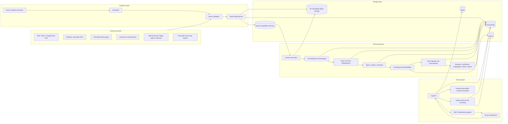
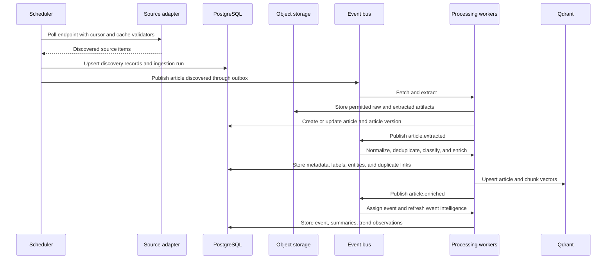
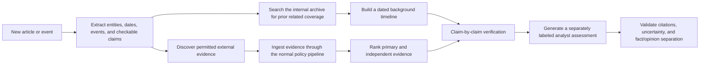
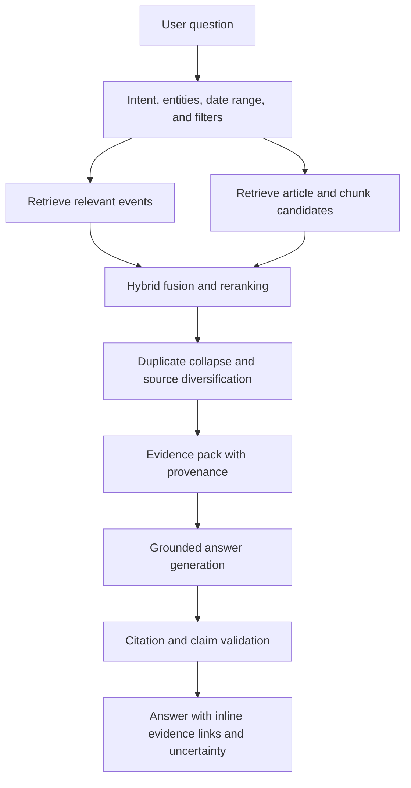
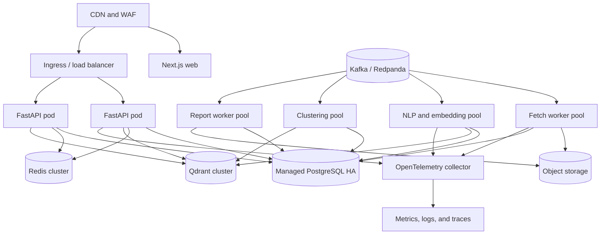

# News Intelligence Platform — System Architecture

Status: Proposed  
Design date: June 25, 2026  
Scope: Architecture and contracts only; implementation code is intentionally deferred.

## 1. Product definition

This platform is not a feed reader. It converts a continuous stream of publications into a structured, searchable knowledge base of:

- real-world events as the primary analytical records;
- publisher articles as source observations of events;
- primary records, datasets, filings, statements, and research as event evidence;
- duplicate, syndicated, derivative, and original-reporting relationships;
- topics, entities, claims, sentiment, and trend signals;
- summaries, briefings, and intelligence reports with evidence;
- personalized recommendations and research answers.

The platform must preserve provenance. Every generated statement shown to a user should be traceable to one or more stored source records.

The mandatory engineering and release constraints are defined in [Critical Implementation Guardrails](IMPLEMENTATION_GUARDRAILS.md). They prohibit placeholder intelligence, fabricated evidence, LLM-generated verdicts/confidence, and unauditable conclusions.

The mandatory event-first domain, temporal, graph, geography, source-reliability, contradiction, gap-detection, and evidence-lineage design is defined in [Event-Centric Intelligence Architecture](EVENT_INTELLIGENCE_ARCHITECTURE.md).

The mandatory multi-channel, recall-optimized, adaptive crawling design is defined in [Recall-Optimized News Acquisition Architecture](ACQUISITION_ARCHITECTURE.md).

### 1.1 Core domain distinction

Four concepts must remain separate:

1. **Event** — the primary evolving record for one real-world development.
2. **Source record** — an article, official document, filing, paper, dataset, statement, or community signal associated with an event.
3. **Article** — one reporting-type source record from one publisher.
4. **Evidence lineage** — source records that derive from one underlying report, statement, record, or dataset.

For example, a Reuters report copied by three publishers is one evidence lineage. A BBC report, a Reuters report, a court order, and a local report about the same ruling are distinct source records attached to one event.

### 1.2 Primary quality goals

- Priority-source records discoverable within 2 minutes of appearing in an official feed/API at p95.
- At-least-once delivery with idempotent processing.
- No silent loss: failures are retried, observable, and eventually dead-lettered.
- Search results favor relevance, recency, provenance, and source diversity.
- AI output includes citations and clearly separates sourced facts from inference.
- Source collection respects feed/API terms, robots rules, rate limits, paywalls, and content rights.

## 2. Architectural principles

### 2.1 Start modular, not fragmented

Thousands of articles per day do not require dozens of microservices. The initial system should be a modular monolith with:

- one FastAPI application;
- multiple worker entry points and queues;
- one scheduler;
- clearly isolated domain packages;
- event contracts and a transactional outbox.

The API, ingestion workers, enrichment workers, and report workers deploy independently. A module can become a separate service later when scaling or ownership justifies it.

### 2.2 PostgreSQL is the source of truth

PostgreSQL owns article identity, workflow state, events, user data, and generated artifacts. Qdrant is a rebuildable search index. Object storage is the immutable artifact store.

### 2.3 Raw input is immutable

Original feed payloads, HTTP response metadata, and permitted raw HTML are retained in object storage according to each source's policy. Re-extraction and model upgrades should not require re-fetching publisher pages.

### 2.4 Every expensive operation is versioned

Extraction, taxonomy, embedding, classifier, prompt, and model versions are stored with results. This allows selective reprocessing instead of destructive replacement.

### 2.5 AI is behind provider-neutral gateways

Application code calls internal interfaces for embeddings, reranking, classification, and generation. Cloud and self-hosted models can be changed without changing domain workflows.

### 2.6 Events are the analytical center

Every normalized incoming source record is assigned to an existing event or creates a provisional event. Assignment is versioned, auditable, and reversible through merge/split/reassignment. Articles remain independently searchable, but event records own the consolidated timeline, evidence, claims, contradictions, geography, propagation, snapshots, and analysis.

### 2.7 Acquisition optimizes measured recall

Each publisher uses multiple cross-validated discovery channels, publisher-specific schedules, incremental change detection, and a versioned strategy. The system reports observed lower-bound recall and estimated recall with uncertainty, continuously audits gaps, and adapts only through bounded canary changes.

## 3. High-level architecture



### 3.1 Concrete technology profile

| Concern | Proposed technology |
|---|---|
| API and services | Python 3.12+, FastAPI, Pydantic, SQLAlchemy 2, Alembic |
| HTTP collection | httpx with host-level policies and connection pools |
| Feed parsing | feedparser plus adapter-level validation |
| Push discovery | WebSub subscriber and partner webhooks |
| HTML parsing/extraction | selectolax and Trafilatura, with publisher-specific rules |
| Canonical database | PostgreSQL |
| Vector retrieval | Qdrant |
| Object artifacts | S3 in production, MinIO locally |
| Cache and rate limits | Redis |
| MVP messaging | Redis Streams behind an internal event-bus interface |
| Production messaging | Kafka or Redpanda |
| Scheduling | PostgreSQL-backed due-job dispatcher using safe row claiming |
| Frontend | Next.js, React, TypeScript |
| Telemetry | OpenTelemetry, Prometheus-compatible metrics, centralized logs |
| Testing and quality | pytest, Ruff, type checking, contract fixtures, ML evaluation suites |

Long-running work never runs in FastAPI in-process background tasks. API processes enqueue work; dedicated workers execute it.

## 4. Source acquisition strategy

### 4.1 Supported acquisition modes

Each source endpoint uses one of these adapter types:

| Mode | Intended use | Typical payload |
|---|---|---|
| `rss` / `atom` | Publisher feeds and topic feeds | Recent URL and metadata |
| `api` | Hacker News, publisher APIs, licensed APIs | Structured records |
| `sitemap` | Discovery where explicitly permitted | URLs and modification time |
| `webhook` | Partner or internal feeds | Push events |
| `bulk` | Research datasets and licensed archives | Batch files |
| `page` | Article extraction after permitted discovery | HTML page |

RSS and Atom are discovery inputs, not guarantees of full text. Google notes that feeds generally expose recent URLs, so the platform must persist cursors and poll frequently rather than treating a feed as an archive.

### 4.2 Source registry

Every source is configuration, not hard-coded control flow. A registry record defines:

- publisher and canonical domain;
- endpoint URL and adapter type;
- polling interval and priority;
- authentication secret reference;
- allowed concurrency and request rate;
- conditional request support (`ETag`, `Last-Modified`);
- extraction permission and retention policy;
- paywall behavior;
- language, country, and default categories;
- adapter configuration;
- health state and circuit-breaker state.

Publisher-specific parsing belongs in adapters selected by source configuration. Generic extraction remains the fallback.

The source registry is paired with a publisher acquisition profile that tracks RSS/Atom feeds, XML/news sitemaps, homepage/section/tag/author/archive monitors, APIs, WebSub, publisher search, internal-link discovery, channel overlap, marginal recall, discovery lead time, publication patterns, and strategy history.

### 4.3 Initial source classes

The first launch should prioritize:

- public feeds and APIs with clear access paths;
- Google News RSS as discovery only, resolving to the original publisher URL;
- the official Hacker News API;
- the arXiv API or approved bulk/OAI access;
- publisher RSS/Atom feeds from BBC, TechCrunch, The Hindu, Hindustan Times, Indian Express, Al Jazeera, India Today, The Wire, NDTV, and others where currently offered;
- licensed APIs or feeds for sources such as Reuters, Bloomberg, and The New York Times when required by their terms.

Exact endpoints, quotas, extraction rights, and display rights must be verified in a source onboarding checklist. Availability changes; publisher names in a product requirement are not proof that automated full-text storage is permitted.

### 4.4 Collection policy

- Use a descriptive crawler user agent with a public contact page.
- Follow robots rules for page fetching.
- Also follow publisher terms and licenses; robots permission alone is not a content license.
- Never bypass paywalls, authentication, CAPTCHAs, or technical access controls.
- Use per-host token buckets, exponential backoff, jitter, and circuit breakers.
- Prefer conditional GET and cache validators.
- Apply SSRF protections: allow `http/https`, resolve DNS safely, reject private/link-local targets, cap redirects, response size, and download time.
- Quarantine unexpected MIME types and malformed payloads.
- Store only snippets and derived data where full-text rights are restricted.

### 4.5 Scheduling

The scheduler calculates the next poll from:

- configured minimum and maximum interval;
- historical publishing frequency by hour and weekday;
- feed update headers;
- recent yield;
- source health and rate-limit responses;
- source priority.

Busy feeds may poll every 1–2 minutes; low-volume feeds may poll every 15–60 minutes. Adaptive scheduling reduces unnecessary traffic without sacrificing freshness.

## 5. Ingestion and processing flow



### 5.1 Pipeline stages

1. **Discover**
   - Parse source payload.
   - Normalize the discovered URL.
   - Create an immutable `discovered_item`.
   - Ignore previously processed external IDs or URL fingerprints.

2. **Fetch**
   - Resolve redirects.
   - Capture HTTP status, headers, content type, response checksum, and fetch duration.
   - Persist raw artifact only if policy permits.

3. **Extract**
   - Use JSON-LD and OpenGraph metadata first.
   - Apply source-specific selectors where maintained.
   - Fall back to a generic readability extractor such as Trafilatura or selectolax-based rules.
   - Remove navigation, advertisements, cookie text, related-story widgets, and repeated boilerplate.
   - Preserve paragraphs, headings, lists, captions, and quote boundaries.
   - Score extraction quality and quarantine low-confidence results.

4. **Normalize**
   - Unicode normalization and whitespace cleanup.
   - Language detection.
   - Canonical publisher, author, date, and URL resolution.
   - Content and paragraph fingerprints.
   - Detect update/correction markers.

5. **Deduplicate**
   - Exact URL and canonical URL match.
   - Exact normalized content hash.
   - SimHash/MinHash candidate generation.
   - Semantic and lexical confirmation.
   - Attach to a duplicate group without deleting the source record.

6. **Enrich**
   - Multi-label topic classification.
   - Named entities and entity linking.
   - Geography and language.
   - Sentiment and target/aspect sentiment.
   - Importance and quality signals.

7. **Index**
   - Chunk by semantic boundaries.
   - Generate dense embeddings.
   - Generate sparse representation for lexical matching.
   - Upsert article and chunk points to Qdrant.

8. **Cluster**
   - Retrieve candidate events.
   - Assign to an existing event or create a new event.
   - Recompute event centroid, title, timeline, source diversity, and status.

9. **Generate intelligence**
   - Article summary.
   - Event summary based on diverse non-duplicate sources.
   - Trend observations.
   - Scheduled reports and personal briefings.

### 5.2 Delivery and state guarantees

- Broker delivery is at least once.
- Every handler is idempotent using `(operation, object_id, version)` keys.
- PostgreSQL updates and emitted events use a transactional outbox.
- Consumers maintain an inbox/deduplication table for processed messages.
- Retries are bounded and classified as transient or permanent.
- Permanent failures enter a dead-letter queue with replay tooling.
- Every stage records status, attempts, error code, duration, input version, and output version.
- Scheduler instances claim due rows with `FOR UPDATE SKIP LOCKED`, set a lease, and emit poll commands. This permits horizontal scheduler replicas without duplicate ownership.

### 5.3 Event contracts

Initial event types:

```text
source.poll.requested
source.poll.completed
article.discovered
article.fetch.requested
article.fetched
article.extracted
article.normalized
article.deduplicated
article.enriched
article.indexed
article.event_assigned
event.updated
context.build.requested
context.built
claim.verify.requested
claim.verified
intelligence.generate.requested
intelligence.generated
pipeline.failed
```

Every envelope includes event ID, event type/version, aggregate type/ID, causation ID, correlation ID, occurred time, producer, trace context, and payload. Payload schemas are versioned and compatibility-tested.

## 6. Deduplication design

Deduplication should optimize two competing goals: suppress repeated content while preserving independent reporting and viewpoints.

### 6.1 Candidate generation

- URL fingerprint after removing tracking parameters and normalizing host/path.
- Canonical URL declared by the page.
- SHA-256 of normalized text for exact copies.
- SimHash over word shingles for fast near-copy detection.
- MinHash/LSH for high lexical overlap.
- Dense-vector nearest neighbors within a configurable time range.

### 6.2 Confirmation score

An interpretable duplicate score can combine:

```text
duplicate_score =
    0.40 * lexical_shingle_similarity
  + 0.25 * body_embedding_similarity
  + 0.15 * title_similarity
  + 0.10 * entity_overlap
  + 0.10 * publication_time_proximity
```

Rules should override the score for exact hashes, canonical URL identity, and known syndication relationships. Thresholds are language- and source-aware and must be tuned on a labeled evaluation set.

### 6.3 Duplicate group behavior

- Keep every article and publisher attribution.
- Select a representative article based on original-source confidence, extraction quality, publication time, and source quality.
- Display “also published by” for syndicated copies.
- Search collapses duplicates by default but allows expansion.
- Event summarization uses at most one article per duplicate group unless differences are material.

## 7. Topic classification and taxonomy

Topics are hierarchical, multi-label, and stored in the database.

Example:

```text
Technology
├── Artificial Intelligence
│   ├── Foundation Models
│   ├── AI Policy
│   └── AI Hardware
├── Cybersecurity
└── Space
    ├── Launches
    ├── Satellite Imaging
    └── Space Policy
```

Initial top-level categories:

- Artificial Intelligence
- Technology
- Business
- Science
- Politics
- Climate
- Space
- Cybersecurity
- Healthcare
- Sports

Each category has a slug, description, parent, examples, exclusions, active flag, and taxonomy version.

### 7.1 Classification strategy

1. Cheap rules and source priors provide candidate labels.
2. An embedding classifier or fine-tuned lightweight model produces multi-label scores.
3. An LLM handles ambiguous or low-confidence articles using structured output.
4. Human corrections are stored as labels for evaluation and later training.

This cascade controls cost while keeping classification extensible. A taxonomy change creates a new version and schedules selective backfills.

## 8. Event clustering

### 8.1 Online assignment

For each normalized source record:

1. Search event centroids from a bounded recent window.
2. Filter by language, geography, entity overlap, and broad topic where appropriate.
3. Compute an assignment score:

```text
event_score =
    0.50 * semantic_similarity
  + 0.20 * entity_overlap
  + 0.15 * temporal_proximity
  + 0.10 * title_similarity
  + 0.05 * geographic_consistency
```

4. Assign to the best event above the calibrated threshold; otherwise create a provisional event.
5. Update the centroid incrementally, weighted by source diversity and duplicate group.

The first assignment may use metadata and lead text so every incoming item immediately has an event context. Full extraction and evidence processing re-evaluate the assignment. All candidates, scores, assignment versions, and corrections are stored.

### 8.2 Offline reconciliation

A scheduled reconciliation job:

- merges events that converged;
- splits events that became semantically broad;
- detects follow-up events linked to a parent story;
- recomputes representative title and timeline;
- prevents a dominant high-volume publisher from controlling the centroid.

Use constrained agglomerative clustering or HDBSCAN over candidate neighborhoods rather than reclustering the full corpus.

### 8.3 Event lifecycle

`emerging → active → cooling → dormant`, with possible reactivation.

An event records:

- occurrence time/precision, first detection, earliest public evidence, first verified report, and last material change;
- canonical title and summary;
- category and entities;
- source-record, article, primary-evidence, and independent-lineage counts;
- source diversity;
- velocity and acceleration;
- geographic scope;
- confidence and lifecycle status;
- parent/child event links.
- snapshot, propagation, contradiction, gap, and evidence-lineage references.

## 9. Search and vector knowledge base

### 9.1 Qdrant layout

Use one collection per embedding model/version, not one collection per user or category. Payload fields provide filtering:

- `object_type`: article, chunk, or event;
- `object_id`;
- `article_id`, `event_id`, `duplicate_group_id`;
- `publisher_id`;
- `published_at`;
- `language`, `country`;
- category slugs;
- entity IDs;
- rights/display flags;
- optional tenant or organization ID.

Named vectors:

- `dense`: semantic embedding;
- `sparse`: lexical representation;
- optional `title_dense`: title-focused embedding.

### 9.2 Hybrid retrieval

Search flow:

1. Parse query intent and filters.
2. Generate dense and sparse query representations.
3. Retrieve candidates from both.
4. Fuse with reciprocal rank fusion.
5. Apply hard rights, tenant, date, language, and category filters.
6. Rerank the top candidates with a cross-encoder or model-based reranker.
7. Apply recency and quality boosts appropriate to the query.
8. Collapse duplicate groups and diversify publishers.
9. Hydrate canonical records from PostgreSQL.

Dense search captures concepts; sparse search preserves names, acronyms, quotations, and exact terms. Qdrant supports combining these representations and recommends rank-based fusion as a safe default when no tuned evaluation set exists.

### 9.3 Chunking

- Article title and lead are indexed as an article-level point.
- Body text is chunked on headings and paragraph boundaries.
- Target 300–600 tokens with 50–100 token overlap only when needed.
- Each chunk retains article, paragraph, and character offsets.
- Tables, captions, and quotes are marked in metadata.
- Chunk vectors are regenerated only when content or embedding version changes.

## 10. AI intelligence layer

### 10.1 Model gateway

Internal capabilities:

- `embed(texts, model_version)`
- `classify(document, taxonomy_version)`
- `rerank(query, documents)`
- `generate_structured(task, evidence, schema)`
- `moderate(input_or_output)`

The gateway provides:

- provider routing and fallback;
- timeout, retry, and concurrency controls;
- token and cost accounting;
- prompt and schema versioning;
- response validation;
- content-hash caching;
- redacted telemetry;
- per-task model policies.

### 10.2 Article summaries

Article summaries are generated from extracted article text and include:

- concise summary;
- key points;
- named entities;
- why it matters;
- uncertainty or extraction warnings.

The article's own URL is the citation. Summary generation is skipped for low-quality extraction or disallowed content.

### 10.3 Event summaries

An event evidence pack:

- removes duplicate copies;
- selects diverse high-quality publishers;
- balances early and recent reporting;
- includes contradictory statements and corrections;
- caps evidence by token budget.

Structured output:

- headline;
- one-paragraph summary;
- confirmed facts;
- disputed or developing details;
- timeline;
- why it matters;
- supporting article IDs for each claim.

Only the evidence pack may be used. Unsupported claims fail validation or are marked as inference.

### 10.4 Historical context and preliminary verification

Every important new article or event can trigger a background context-and-verification workflow. It runs asynchronously so it does not delay near-real-time publication.



#### Historical context retrieval

The workflow searches backward from the article's publication time using:

- matching events and parent/follow-up event links;
- named entities, locations, organizations, products, and policies;
- semantic article and chunk retrieval;
- important dates and quoted claims;
- publisher archives, search APIs, official records, and approved knowledge sources.

Newly discovered historical URLs are sent through the same source-policy, fetch, extraction, deduplication, and indexing pipeline as current news. The system does not bypass paywalls or retain prohibited text merely because it is being used as background.

The resulting context card contains:

- a concise “what led to this” explanation;
- a dated timeline of material earlier developments;
- related prior events and articles;
- original or earliest known reporting when it can be established;
- corrections, reversals, and unresolved disagreements;
- citations for every factual background statement.

#### Claim-level verification

The system must not label an entire article true or false. It extracts a small set of material, externally checkable claims and evaluates each one separately.

Evidence priority:

1. primary evidence such as legislation, court documents, regulatory filings, official statistics, research papers, transcripts, and direct records;
2. independent high-quality reporting with original sourcing;
3. reputable specialist or fact-checking organizations;
4. other corroborating sources, clearly weighted below primary evidence.

Multiple articles repeating the same wire story count as one evidence lineage, not independent confirmation. Source independence, ownership, syndication, quotation chains, publication time, corrections, and conflicts of interest are recorded in the evidence score.

Allowed preliminary verdicts:

- `supported` — reliable evidence directly supports the claim;
- `disputed` — credible sources or records materially conflict;
- `misleading` — some literal support exists, but stored decisive context makes the presented implication materially inaccurate;
- `unsupported` — retrieval coverage is adequate, but no sufficient evidence supports the claim;
- `contradicted` — reliable evidence directly conflicts with the claim;
- `not_checkable` — opinion, prediction, vague wording, or insufficiently specific claim.

These are the only permitted published labels. Each verdict includes the exact claim, exact evidence passages or structured fields, source URLs/types, retrieval timestamps, evidence for and against, source lineage, deterministic decision trace, confidence methodology/components, checked time, and a plain-language explanation.

`Unsupported` is permitted only after the configured retrieval-coverage threshold has been met. If retrieval fails or coverage is inadequate, the system publishes no verdict and returns `Insufficient evidence available.` High-impact verdicts such as `misleading` or `contradicted` require strong primary evidence or human review before prominent display.

This is presented as **preliminary automated verification**, not a replacement for professional fact-checkers.

#### Verification execution boundary

Evidence retrieval and persistence happen before verification. The retrieval plan selects applicable historical reporting, government or court records, scientific papers, press releases, regulatory filings, official statistics, and independent reporting.

Models may extract candidate claims, identify candidate passages, classify evidence stance, and draft cited explanations. They may not set final labels or published confidence. A versioned deterministic policy engine:

1. validates claim checkability;
2. validates stored evidence and source offsets;
3. resolves source lineages and collapses syndicated copies;
4. computes evidence weights and retrieval coverage;
5. applies explicit label rules;
6. computes confidence features;
7. writes the complete decision trace and verification revision.

The Analyst Assessment receives the persisted verification record as read-only input and cannot alter it.

#### Analyst assessment

After facts and uncertainty are assembled, the platform generates a clearly labeled **Analyst Assessment** containing:

- implications of the development;
- risks, uncertainties, and affected groups;
- plausible alternative interpretations or explanations;
- important missing information;
- evidence that would increase or decrease confidence;
- an overall confidence estimate and time horizon.

The assessment is analytical rather than opinionated. It must cite the facts it relies on, distinguish evidence from inference, avoid normative endorsements, and disclose important assumptions. For political or contested subjects it should represent serious competing interpretations rather than manufacture a single supposedly neutral conclusion. It must not present individualized medical, legal, or financial advice.

#### Canonical article-intelligence output contract

The user-facing order and section names are fixed:

1. **Article Summary**
   - Concise account of what the article reports.
   - Article citation and publication/update times.
   - No verification verdict is applied to the article as a whole.

2. **Key Claims**
   - Only material, externally checkable claims.
   - Each item shows the exact normalized claim, verdict, confidence, short rationale, and citation links.
   - Example: `Claim A → Supported (92% confidence)`.
   - `Not Checkable` claims do not receive a truth-confidence percentage.

3. **Historical Timeline**
   - Dated prior events in chronological order.
   - Every event includes one or more citations.
   - Events published after the subject article are excluded from “prior context” and may appear separately as later updates.

4. **Evidence Review**
   - Supporting evidence.
   - Contradicting evidence.
   - Contextual or inconclusive evidence.
   - Evidence type, publication date, source authority, and relationship to the claim.

5. **Source Independence Score**
   - Displayed as `High`, `Medium`, or `Low`, with a numeric score and explanation available on expansion.
   - Calculated from distinct evidence lineages, ownership groups, original sourcing, syndication, citation chains, and source-type diversity.
   - Repeated articles derived from the same wire report, press release, filing, or unnamed common source count as one lineage.

6. **Analyst Assessment**
   - Implications.
   - Risks and uncertainties.
   - Alternative interpretations or explanations.
   - Missing information.
   - Evidence that would increase confidence.
   - Evidence that would decrease confidence.
   - Overall confidence assessment and time horizon.

7. **Open Questions**
   - What remains unknown?
   - What evidence is still missing?
   - Which disputed claims require follow-up?
   - When should the analysis be checked again?

8. **Method and Provenance**
   - Last-checked time.
   - Models, prompts, taxonomy, and verification-policy versions.
   - Evidence-selection criteria and important exclusions.
   - Human-review status and correction history.

#### Confidence and transparency rules

- Confidence expresses the system's calibrated confidence in a specific verdict or analytical conclusion, not the probability that an entire article is true.
- Percentages are shown only after calibration against a labeled evaluation set. Before calibration, the product displays `High`, `Medium`, or `Low` rather than false precision.
- Confidence is calculated by application code—not generated by an LLM—from source reliability, independent-confirmation strength, evidence consistency for the selected label, temporal applicability/recency, contradictory-evidence weight, retrieval coverage, extraction quality, and claim specificity.
- The system stores the raw feature vector, per-feature contribution, uncalibrated score, calibrator/formula version, calibrated score, thresholds, and label-policy version.
- A high source-independence score cannot compensate for weak evidence, and authoritative evidence from one primary record may be stronger than many derivative reports.
- Every factual statement and analytical conclusion must link to its evidence manifest. Speculation must be labeled explicitly and include the assumptions that support it.
- Transparency means showing evidence, source relationships, retrieval operations, scoring factors, triggered rules, assumptions, and a concise decision rationale. This reproducible decision trace replaces any demand for private model chain-of-thought.
- Material corrections or new evidence trigger a new verification revision and may change verdicts or confidence.

The structured response must keep facts, evidence, analysis, and speculation in separate fields so neither the API nor the interface can accidentally blend them.

Illustrative rendered output:

```text
Article Summary
<summary> [A1]

Key Claims
Claim A → Supported (92% confidence) [E1, E2]
Claim B → Disputed (65% confidence) [E3, E4]
Claim C → Not Checkable

Historical Timeline
2025-11-10 — Event 1 [H1]
2026-02-03 — Event 2 [H2]
2026-06-20 — Event 3 [H3]

Evidence Review
Supporting evidence: ...
Contradicting evidence: ...
Inconclusive/contextual evidence: ...

Source Independence Score
High (84/100) — three independently sourced evidence lineages

Analyst Assessment
Implications: ...
Risks and uncertainties: ...
Alternative explanations: ...
Missing information: ...
Would increase confidence: ...
Would decrease confidence: ...
Overall confidence: Medium

Open Questions
- What remains unknown?
- What evidence is still missing?

Method and Provenance
Last checked: <timestamp>
Human review: Not reviewed
```

### 10.5 Sentiment

Store both:

- document tone: positive, neutral, negative, mixed;
- target/aspect sentiment: sentiment toward a company, person, policy, product, team, or event.

Generic article sentiment is often misleading for hard news, so UI labels should say “tone” unless a target is specified.

### 10.6 Trends and emerging topics

Signals are computed over 1-hour, 6-hour, 24-hour, 7-day, and 30-day windows:

- event publication velocity and acceleration;
- unique publisher count and source diversity;
- topic/entity frequency versus historical baseline;
- novelty against existing events;
- geographic spread;
- search and user-follow activity;
- social/community signal where licensed.

Example trend score:

```text
trend_score =
    burst_z_score
  * log(1 + unique_publishers)
  * novelty_factor
  * source_quality_factor
  * freshness_decay
```

One noisy publisher must not create a trend. A minimum unique-source threshold and duplicate collapse are mandatory.

### 10.7 Reports

Report templates are data:

- daily intelligence brief;
- weekly category review;
- monthly strategic report;
- personalized briefing.

Each report stores the generation window, template version, model version, sections, citations, and status. Reports are immutable after publication; corrections create a new revision.

## 11. Research assistant



### 11.1 Query behavior

Examples:

- “What happened in AI this week?” becomes an AI category filter and exact date window.
- “Biggest developments in satellite imaging this month” adds category/entity expansion and event importance ranking.
- “Which cybersecurity topics are gaining momentum?” invokes trend retrieval rather than plain article search.

### 11.2 Answer contract

Every answer returns:

- a direct answer;
- citations mapped to article or event IDs;
- the interpreted date range and filters;
- source count and publisher diversity;
- uncertainty or conflicting evidence;
- suggested follow-up questions.

If evidence is insufficient, the assistant says so. It must not fill gaps from model memory.

### 11.3 Retrieval guardrails

- Enforce source rights before evidence reaches the model.
- Treat article content as untrusted data, not instructions.
- Strip or isolate prompt-injection-like text.
- Limit evidence length per source.
- Require at least two independent sources for high-confidence event synthesis when possible.
- Run citation entailment checks before returning an answer.

## 12. Personalization

Personalization combines explicit and implicit signals.

Explicit:

- followed categories, entities, publishers, and saved searches;
- blocked topics and publishers;
- preferred language, region, cadence, and briefing time.

Implicit:

- article opens;
- dwell time bands;
- saves, shares, hides, and follows;
- search and assistant interactions.

Recommendation ranking combines topical affinity, novelty, event importance, source diversity, freshness, and exploration. Sensitive-trait inference is excluded. Users can inspect and reset their profile.

Briefing generation first selects and ranks events deterministically, then uses AI only to compose the final narrative. This avoids letting a language model silently decide what news a user sees.

## 13. Data model

Use UUIDv7 identifiers for time-sortable distributed IDs. All timestamps are `timestamptz` in UTC. User-facing timezone conversion happens at the edge.

### 13.1 Source and ingestion tables

#### `publishers`

| Column | Type | Notes |
|---|---|---|
| `id` | uuid PK | |
| `name` | text | |
| `slug` | citext unique | |
| `canonical_domain` | citext unique | |
| `country_code` | char(2) | nullable |
| `default_language` | text | BCP-47 |
| `quality_tier` | smallint | editorial configuration |
| `ownership_group` | text | used for diversity |
| `active` | boolean | |
| `created_at`, `updated_at` | timestamptz | |

#### `source_endpoints`

| Column | Type | Notes |
|---|---|---|
| `id` | uuid PK | |
| `publisher_id` | uuid FK | nullable for aggregators |
| `name` | text | |
| `adapter_type` | enum | rss, atom, api, sitemap, webhook, bulk |
| `endpoint_url` | text | encrypted/secret ref if needed |
| `config` | jsonb | adapter-specific |
| `poll_min_seconds`, `poll_max_seconds` | integer | |
| `rate_limit_per_minute` | numeric | |
| `max_concurrency` | integer | |
| `cursor` | jsonb | opaque adapter state |
| `etag`, `last_modified` | text | conditional requests |
| `next_poll_at` | timestamptz | indexed |
| `health_status` | enum | healthy, degraded, paused |
| `active` | boolean | |

#### `source_policies`

Stores access mode, robots cache state, terms review date, full-text storage permission, display permission, retention period, paywall handling, attribution requirement, and reviewer.

#### `ingestion_runs`

One row per poll or bulk import, including start/end, status, discovered count, new count, HTTP status, latency, bytes, retry count, and error summary.

#### `discovered_items`

Immutable normalized source payload:

- source endpoint and ingestion run;
- external ID;
- discovered URL and normalized URL hash;
- title, published time, author hints;
- raw payload object key or JSONB;
- discovery timestamp;
- processing status.

Unique constraints:

- `(source_endpoint_id, external_id)` when external ID exists;
- `(source_endpoint_id, normalized_url_hash)` otherwise.

### 13.2 Article tables

#### `articles`

| Column | Type | Notes |
|---|---|---|
| `id` | uuid PK | |
| `publisher_id` | uuid FK | |
| `source_endpoint_id` | uuid FK | |
| `canonical_url` | text | |
| `normalized_url_hash` | bytea unique | global URL identity |
| `title`, `subtitle` | text | |
| `author_line` | text | original display form |
| `published_at`, `modified_at` | timestamptz | |
| `language` | text | BCP-47 |
| `country_code` | char(2) | nullable |
| `content_status` | enum | discovered, extracted, restricted, failed |
| `extraction_quality` | real | 0–1 |
| `paywall_status` | enum | none, soft, hard, unknown |
| `rights_policy_id` | uuid FK | |
| `duplicate_group_id` | uuid FK | nullable |
| `event_id` | uuid FK | current event after provisional assignment |
| `metadata` | jsonb | structured extras |
| `created_at`, `updated_at` | timestamptz | |

Indexes:

- `(published_at desc)`;
- `(publisher_id, published_at desc)`;
- `(event_id, published_at)`;
- `(duplicate_group_id)`;
- GIN on selected metadata only when query patterns justify it.

#### `article_versions`

- article ID;
- version number;
- normalized content hash;
- clean text;
- lead text;
- word count;
- raw HTML object key;
- extracted artifact object key;
- extractor and parser versions;
- extraction diagnostics;
- fetched and created times.

Unique: `(article_id, content_hash)`.

#### `authors` and `article_authors`

Support normalized author identities while preserving the original byline and author order.

#### `article_chunks`

- article version ID;
- ordinal;
- heading path;
- text;
- token count;
- character and paragraph offsets;
- chunk content hash.

Unique: `(article_version_id, ordinal)`.

### 13.3 Enrichment tables

#### `categories`

Self-referencing hierarchy with slug, description, examples, exclusions, active flag, and taxonomy version.

#### `article_categories`

Article ID, category ID, confidence, method, model version, taxonomy version, and optional human-review state.

#### `entities`

Canonical entity name, type, aliases, external knowledge IDs, and metadata.

#### `article_entities`

Article ID, entity ID, mention count, salience, sentiment score, and mention offsets or artifact reference.

#### `sentiment_results`

Subject type/ID, target entity ID if applicable, label, score, aspects JSONB, model version, and evidence offsets.

#### `claims`

One material claim extracted from an article or event:

- normalized claim text and original quoted text;
- subject article/event and source offsets;
- claim type and checkability;
- entities, location, and applicable time range;
- extractor/model version;
- status and human-review state.

#### `evidence_items`

One primary record or publication used to evaluate a claim:

- evidence URL and canonical source record;
- evidence type and publication/record date;
- retrieval run and retrieval timestamp;
- supporting, contradicting, or contextual stance;
- exact supporting passage or structured-data reference;
- source offsets and content hash;
- source lineage, origin evidence, ownership group, and syndication type;
- authority, relevance, and extraction-quality scores;
- rights policy and retrieval time.

#### `retrieval_runs` and `retrieval_results`

Store the subject, retrieval purpose, query text/embedding, filters, required source classes, provider/index, start/end times, candidates, ranks, similarity/reranking scores, selection state, exclusion reason, coverage metrics, and failure details.

#### `evidence_lineages`

Represent one underlying reporting or record origin. Store origin source/evidence, ownership group, known syndication relationship, lineage-detection method/version, confidence, and human-review state. Reuters republications on Yahoo, MSN, and local newspapers therefore contribute one independent lineage.

#### `claim_verifications`

Claim ID, verdict or insufficient-evidence state, confidence band/score, explanation, evidence-for/evidence-against manifests, retrieval coverage, verification-policy version, checked time, expiry/recheck time, and reviewer state. Rechecks create revisions rather than overwriting history.

Integrity rules:

- verdict is limited to the six-label contract;
- insufficient-evidence state requires a null verdict;
- every published verdict has the source-article citation and evidence/decision manifest;
- numeric confidence requires an approved calibrator version;
- model-worker database roles cannot write final verdict or confidence fields.

#### `verification_calculations`

Persist every reproducible intermediate:

- verification revision and claim;
- evidence item/lineage weights;
- source-reliability version and value;
- claim relevance;
- extraction quality;
- temporal applicability/recency;
- supporting, contradicting, and contextual evidence mass;
- independent lineage count and strength;
- evidence consistency;
- retrieval coverage;
- raw confidence feature vector;
- per-feature contribution;
- formula/calibrator and threshold versions;
- uncalibrated/calibrated score;
- triggered rules and final label.

#### `context_timelines` and `context_timeline_items`

Versioned background timelines for an article or event, with dated entries, date precision, related event/article and evidence IDs, source URL/type, retrieval time, source offsets, citations, importance score, and generated explanation. Database and response validators reject entries without stored evidence.

### 13.4 Duplicate and event tables

#### `duplicate_groups`

Representative article, duplicate type, confidence, earliest publication time, and content family fingerprint.

#### `duplicate_memberships`

Group ID, article ID, relationship type (`exact`, `syndicated`, `near_copy`), score, method, and creation time.

#### `events`

| Column | Type | Notes |
|---|---|---|
| `id` | uuid PK | |
| `slug` | text unique | |
| `title` | text | generated but editable |
| `summary_id` | uuid FK | nullable |
| `primary_category_id` | uuid FK | |
| `status` | enum | emerging, active, cooling, dormant |
| `occurred_at`, `occurred_at_precision` | timestamptz, enum | nullable/uncertain |
| `first_detected_at`, `earliest_public_evidence_at` | timestamptz | distinct latency clocks |
| `first_verified_report_at`, `last_material_change_at` | timestamptz | |
| `article_count`, `unique_source_count` | integer | cached aggregates |
| `source_diversity_score` | real | |
| `importance_score`, `velocity_score` | real | |
| `centroid_point_id` | uuid | Qdrant point |
| `cluster_version` | text | |
| `confidence` | real | |
| `metadata` | jsonb | geography, corrections, etc. |

#### `event_articles`

Event ID, article ID, assignment score, role, is representative, added time, and cluster version.

This is retained as an article-optimized projection. The canonical event architecture uses versioned `source_records`, `source_record_versions`, and `event_assignments` so primary documents and community signals can attach to events without pretending to be articles.

#### `event_links`

Directed relationships such as `follow_up_to`, `caused_by`, `part_of`, and `contradicts`.

### 13.5 Vector and generation tables

#### `embedding_records`

Object type/ID, chunk ID if applicable, model provider/name/version, dimensions, content hash, Qdrant collection and point ID, status, and timestamps.

#### `generated_artifacts`

Generic immutable store for article summaries, event summaries, analyst assessments, titles, explanations, and report sections:

- subject type and ID;
- artifact type;
- text and structured JSON;
- evidence manifest;
- prompt/template version;
- model version;
- cost and token counts;
- validation status;
- revision and creation time.

Analyst-assessment artifacts reference an immutable claim-verification revision. They have no update path to verification tables.

#### `model_invocations`

Task type, subject, provider/model/version, prompt-template version, rendered prompt or access-controlled object key, structured response, token/cost/latency metadata, validator results, trace ID, and creation time. Model outputs are retained according to rights, privacy, and security policy.

#### `trends` and `trend_observations`

Trend identity plus time-windowed scores, baseline, velocity, source diversity, supporting event IDs, and explanation.

#### `reports`, `report_sections`, `report_citations`

Report schedule/window, type, audience, revision, publish status, rendered object keys, sections, and citation mappings.

### 13.6 User and personalization tables

- `users`
- `organizations` and `organization_memberships` if B2B access is planned
- `user_topic_follows`
- `user_entity_follows`
- `user_publisher_preferences`
- `saved_searches`
- `reading_events`
- `user_interest_profiles`
- `briefings`
- `briefing_items`
- `notification_preferences`

Reading events should have a short raw-retention period. Long-term profiles should store aggregated interests rather than indefinitely retaining fine-grained behavior.

### 13.7 Reliability tables

- `processing_jobs`
- `processing_attempts`
- `outbox_events`
- `consumer_inbox`
- `dead_letters`
- `model_usage_ledger`
- `model_invocations`
- `retrieval_runs`
- `audit_log`

### 13.8 Partitioning policy

Do not partition prematurely. At a few thousand articles per day, well-indexed PostgreSQL tables are sufficient.

When tables become large:

- range-partition `discovered_items`, `article_versions`, `article_chunks`, `reading_events`, and usage/observability tables by month;
- retain global identity tables such as `articles` unpartitioned, or use a separate unpartitioned identity table;
- archive detached old partitions to cheaper storage;
- automate future partition creation.

PostgreSQL requires partition keys to be included in partitioned-table unique constraints, which is why global URL identity should not depend on a date-partitioned uniqueness rule.

## 14. API structure

Base path: `/api/v1`

### 14.1 Public/user APIs

| Method and path | Purpose |
|---|---|
| `GET /articles` | Filtered, cursor-paginated article feed |
| `GET /articles/{id}` | Article metadata, summary, context, verification status, event, and sources |
| `GET /articles/{id}/intelligence` | Complete canonical intelligence output in the fixed section contract |
| `GET /articles/{id}/context` | Prior timeline and related historical coverage |
| `GET /articles/{id}/claims` | Claim checks, evidence, confidence, and review status |
| `GET /articles/{id}/assessment` | Separately labeled analyst assessment |
| `GET /events` | Event feed with trend and category filters |
| `GET /events/{id}` | Primary event intelligence record |
| `GET /events/{id}/sources` | Reporting, primary evidence, and community signals by role |
| `GET /events/{id}/snapshots` | Narrative, evidence, and verification evolution |
| `GET /events/{id}/propagation` | Attribution network and reporting latency |
| `GET /events/{id}/contradictions` | Competing claims and supporting evidence |
| `GET /events/{id}/gaps` | Missing context, evidence, and open questions |
| `GET /events/{id}/lineage` | Machine-readable evidence provenance |
| `GET /search` | Hybrid search over articles/events |
| `POST /research/ask` | Evidence-grounded natural-language answer |
| `GET /research/answers/{id}` | Retrieve an async/streamed answer |
| `GET /trends` | Emerging and trending topics |
| `GET /trends/{id}` | Trend explanation and supporting events |
| `GET /categories` | Versioned topic taxonomy |
| `GET /reports` | Available intelligence reports |
| `GET /reports/{id}` | Report with citations |
| `GET /briefings/latest` | Current personalized briefing |
| `POST /follows` | Follow a topic/entity/publisher/search |
| `DELETE /follows/{id}` | Remove a follow |
| `POST /feedback` | Corrections, relevance, hide/save signals |
| `GET /stream` | Server-sent real-time event/trend updates |

### 14.2 Administrative APIs

| Method and path | Purpose |
|---|---|
| `GET/POST /admin/sources` | Manage source endpoints |
| `POST /admin/sources/{id}/poll` | Trigger a poll |
| `GET /admin/sources/{id}/health` | Yield, errors, latency, freshness |
| `GET/PATCH /admin/policies/{id}` | Rights and crawler policy |
| `GET/POST/PATCH /admin/categories` | Taxonomy management |
| `POST /admin/articles/{id}/reprocess` | Version-aware replay |
| `POST /admin/articles/{id}/verify` | Re-run context and preliminary verification |
| `PATCH /admin/claims/{id}` | Human review or correction of a claim verdict |
| `POST /admin/events/{id}/merge` | Curated event merge |
| `POST /admin/events/{id}/split` | Curated event split |
| `GET /admin/jobs` | Pipeline state and failures |
| `POST /admin/dead-letters/{id}/replay` | Controlled replay |
| `GET /admin/model-usage` | Cost, latency, and quality metrics |

### 14.3 API conventions

- OAuth/OIDC authentication and role-based authorization.
- Cursor pagination; avoid deep `OFFSET`.
- Idempotency keys for mutating endpoints.
- ETags for cacheable reads.
- RFC 7807 problem details for errors.
- Async research/report operations return `202` and stream progress over SSE.
- Stable resource schemas; generated artifact revisions are explicit.
- OpenAPI generated by FastAPI and checked in CI for breaking changes.

## 15. Repository and folder structure

```text
news/
├── README.md
├── pyproject.toml
├── uv.lock
├── package.json
├── backend/
│   ├── src/newsintel/
│   │   ├── api/
│   │   │   ├── routes/
│   │   │   ├── dependencies/
│   │   │   └── schemas/
│   │   ├── core/
│   │   │   ├── config.py
│   │   │   ├── logging.py
│   │   │   ├── security.py
│   │   │   └── telemetry.py
│   │   ├── domains/
│   │   │   ├── sources/
│   │   │   ├── articles/
│   │   │   ├── taxonomy/
│   │   │   ├── duplicates/
│   │   │   ├── events/
│   │   │   ├── search/
│   │   │   ├── intelligence/
│   │   │   ├── research/
│   │   │   └── personalization/
│   │   ├── adapters/
│   │   │   ├── collectors/
│   │   │   ├── extractors/
│   │   │   ├── llm/
│   │   │   ├── embeddings/
│   │   │   ├── vector/
│   │   │   ├── object_store/
│   │   │   └── messaging/
│   │   ├── pipelines/
│   │   │   ├── ingestion/
│   │   │   ├── enrichment/
│   │   │   ├── clustering/
│   │   │   └── reporting/
│   │   ├── workers/
│   │   └── main.py
│   ├── migrations/
│   └── tests/
│       ├── unit/
│       ├── integration/
│       ├── contract/
│       ├── pipeline/
│       └── evals/
├── frontend/
│   ├── app/
│   ├── components/
│   ├── features/
│   ├── lib/
│   └── tests/
├── configs/
│   ├── taxonomy/
│   ├── sources/
│   ├── prompts/
│   └── report_templates/
├── infra/
│   ├── compose/
│   ├── docker/
│   ├── kubernetes/
│   ├── terraform/
│   └── observability/
├── scripts/
├── docs/
│   ├── ARCHITECTURE.md
│   ├── EVENT_INTELLIGENCE_ARCHITECTURE.md
│   ├── ACQUISITION_ARCHITECTURE.md
│   ├── IMPLEMENTATION_PLAN.md
│   ├── IMPLEMENTATION_GUARDRAILS.md
│   ├── adr/
│   ├── api/
│   └── runbooks/
└── .github/workflows/
```

Domain modules own business rules and repository interfaces. Adapters own external technology. Route handlers and workers call application services; they do not contain domain logic.

## 16. Deployment strategy

### 16.1 Local development

Docker Compose:

- FastAPI;
- worker;
- scheduler;
- PostgreSQL;
- Qdrant;
- Redis;
- MinIO;
- optional local model/reranker;
- Next.js.

Use test containers or Compose profiles for integration tests. Seed only public test fixtures, not copied production articles.

### 16.2 MVP environment

A cost-conscious managed deployment:

- API container;
- two worker pools: collection/extraction and AI/indexing;
- scheduler container;
- managed PostgreSQL;
- managed or single-node Qdrant with backups;
- managed Redis;
- S3-compatible object storage;
- CDN-hosted Next.js;
- a lightweight broker initially, behind a messaging abstraction.

### 16.3 Production topology



Production recommendations:

- Kubernetes or an equivalent container orchestrator.
- One Uvicorn process per pod; scale pods horizontally.
- Separate worker pools and autoscaling policies per queue.
- Managed PostgreSQL with multi-AZ failover, point-in-time recovery, connection pooling, and read replicas when needed.
- Qdrant replication, snapshots, tested restore, and payload indexes.
- Kafka-compatible broker with partitioning by article/event ID.
- Object storage lifecycle policies and cross-region replication if required.
- Secrets manager and workload identity; no long-lived credentials in images.

### 16.4 Environments and delivery

- `dev`, `staging`, and `production` are isolated accounts/projects.
- Terraform controls infrastructure.
- Containers are pinned by digest and scanned.
- CI runs lint, type checks, unit tests, migrations, API compatibility, security scans, and ML eval smoke tests.
- CD uses canary or rolling deployment.
- Database changes follow expand/migrate/contract.
- Prompt, taxonomy, and model changes use versioned rollout and shadow evaluation.

## 17. Scalability and performance

### 17.1 Capacity example

At 10,000 new articles/day:

- 3.65 million articles/year;
- 10 KB average clean text is roughly 36.5 GB/year before database overhead;
- 100 KB average permitted raw HTML is roughly 365 GB/year in object storage;
- one 1,536-dimension float32 vector/article is about 22 GB/year before index overhead;
- five chunk vectors/article multiply raw vector storage to roughly 110 GB/year before index overhead.

These are planning examples, not quotas. Actual language, article length, chunking, vector dimensions, replication, and index configuration dominate cost.

### 17.2 Scaling controls

- Backpressure from broker lag and queue age.
- Per-host concurrency isolation so one publisher cannot starve others.
- Batch embedding calls and Qdrant upserts.
- Autoscale CPU extraction workers separately from GPU/model workers.
- Run fetch, extraction, embedding, clustering, verification, timeline, assessment, and reporting only in asynchronous worker pools.
- Scale collection, extraction, retrieval, model, verification, and reporting workers independently.
- Cache event pages, taxonomy, and common queries in Redis/CDN.
- Use keyset pagination.
- Precompute event aggregates and trend windows.
- Use read replicas for report and analytics reads.
- Archive raw artifacts and cold partitions by policy.
- Rebuild Qdrant from PostgreSQL/object storage through versioned indexing jobs.

### 17.3 Hot-path targets

- Article/event list API p95 under 300 ms from cache and under 700 ms uncached.
- Search p95 under 1.5 seconds before optional answer generation.
- Research answer first streamed token under 5 seconds for warm dependencies.
- Ingestion discovery p95 under 2 minutes after an item appears in a priority source's official feed/API.
- Newly discovered article metadata visible before enrichment, with verification and assessment populated asynchronously.
- Sustained capacity above 10,000 new articles/day and tested burst capacity of at least 10× the average arrival rate.
- Pipeline success above 99%, excluding explicit policy restrictions.

## 18. Reliability and observability

### 18.1 Metrics

Source:

- poll success, latency, yield, stale duration;
- HTTP status and throttling;
- extraction quality and failure rate.

Pipeline:

- queue depth and oldest message age;
- stage throughput, latency, retry, and dead-letter rates;
- duplicate and clustering confidence distributions;
- vector indexing lag.

AI:

- tokens, cost, latency, cache hit rate;
- schema validation failure;
- citation coverage and entailment;
- retrieval coverage by required source class;
- evidence-selection and exclusion counts;
- source-lineage collapse and independence distributions;
- verification label, confidence-component, and refusal distributions;
- timeline entries rejected for missing citations or invalid dates;
- Analyst Assessment attempts blocked for insufficient evidence;
- fallback rate.

Product:

- search success and reformulation;
- citation opens;
- briefing open/save/hide;
- source diversity shown to users.

### 18.2 Tracing and logs

OpenTelemetry trace IDs flow from discovery through article, evidence retrieval, verification, timeline, assessment, event, search, and answer generation. Durable audit records reference retrieved sources, embeddings/model versions, similarity and reranking scores, evidence mappings, lineage decisions, verification calculations, prompts, structured model responses, validators, and revisions. Logs are structured and redact secrets, user prompts where required, and licensed full text.

### 18.3 Runbooks

Required runbooks:

- source blocked or rate-limited;
- extraction quality regression;
- broker lag;
- PostgreSQL failover;
- Qdrant restore/reindex;
- model provider outage;
- bad prompt/model rollout;
- retrieval coverage regression;
- confidence calibration or verification-policy regression;
- source-lineage error and bulk verdict recalculation;
- duplicate/event clustering regression;
- legal takedown or publisher deletion request.

## 19. Security, compliance, and content governance

- OIDC, MFA for administrators, RBAC, and organization-level authorization.
- TLS everywhere and encryption at rest.
- Secrets manager with rotation.
- WAF, API rate limiting, abuse detection, and audit logging.
- SSRF-safe fetch service in an isolated network segment.
- HTML sanitization; never render fetched publisher HTML directly.
- Dependency, image, and infrastructure scanning.
- Data retention and deletion policies by source and user.
- Provenance and rights flags enforced in search, generation, exports, and UI.
- Publisher takedown workflow that deletes or restricts raw text, vectors, caches, and generated excerpts.
- Content safety controls for harmful or graphic material.
- No training on publisher text unless the license explicitly permits it.

Legal review is a launch requirement for full-text storage and redistribution. The safe fallback is to store metadata, permitted snippets, derived embeddings, and outbound links.

## 20. Evaluation strategy

AI quality cannot be validated only with unit tests.

Maintain versioned evaluation sets for:

- extraction quality across publisher templates;
- exact and near-duplicate pairs;
- same-event and different-event article pairs;
- multi-label topic classification;
- search relevance judgments;
- trend detection precision;
- summary factuality and citation coverage;
- historical-context relevance and chronological correctness;
- claim-verification precision, calibration, evidence independence, and verdict stability;
- analyst-assessment fact/inference separation and viewpoint coverage;
- research question answerability and groundedness;
- recommendation diversity and relevance.

Track precision, recall, F1, NDCG, MRR, calibration, citation entailment, source diversity, latency, and cost. Model or threshold changes must pass regression gates.

### 20.1 Mandatory automated suites

Every feature has unit and integration coverage. Release-blocking suites test:

1. exact, near-duplicate, syndication, and source-lineage detection;
2. historical timeline date accuracy, citation validity, and cutoff enforcement;
3. claim extraction quality on labeled fixtures;
4. evidence-retrieval coverage across required source classes;
5. citation completeness and exact evidence offsets;
6. verification-label consistency for fixed evidence/calculation inputs;
7. confidence reproducibility, calibration, and stored feature contributions;
8. insufficient-evidence refusal behavior;
9. Analyst Assessment isolation from verification state;
10. rights/authorization filtering;
11. queue replay, idempotency, retry, and dead-letter recovery;
12. throughput, backpressure, and horizontal worker scaling.

Probabilistic components also require labeled evaluation thresholds. A passing unit test does not qualify an unmeasured model workflow for production.

## 21. Key architecture decisions

| Decision | Choice | Reason |
|---|---|---|
| Application shape | Modular monolith plus independent workers | Production discipline without premature service sprawl |
| Canonical store | PostgreSQL | Transactions, relational integrity, flexible JSONB, mature operations |
| Vector store | Qdrant | Dense+sparse hybrid queries, payload filtering, scale-out path |
| Spatial intelligence | PostGIS | Canonical places, spatial indexes, regional queries, and geographic clustering |
| Knowledge graph | PostgreSQL typed edges first; optional Neo4j projection | Preserve canonical provenance while deferring graph operational cost until needed |
| Raw artifacts | S3-compatible storage | Cheap immutable retention and reprocessing |
| Production events | Kafka-compatible broker | Replay, fan-out, backpressure, partitioned scale |
| Cache/coordination | Redis | Low-latency cache, rate limits, transient coordination |
| Scheduling | PostgreSQL-backed leased dispatcher | Simple, observable, horizontally safe scheduling without a second workflow database |
| Search | Dense + sparse + reranking | Better concept and exact-term recall |
| Clustering | Online assignment + offline reconciliation | Freshness with correction of early mistakes |
| AI integration | Provider-neutral model gateway | Cost, reliability, and model portability |
| Frontend | Next.js/TypeScript | Modern dashboard, SSR, streaming, broad ecosystem |

## 22. Explicit non-goals for the MVP

- Crawling the entire web.
- Bypassing paywalls or republishing restricted full text.
- Fully autonomous factual adjudication.
- Perfect multilingual clustering on day one.
- A separate microservice for every pipeline stage.
- Training proprietary foundation models.
- Sub-second generative research answers.

## 23. Verified technical references

- [PostgreSQL declarative partitioning](https://www.postgresql.org/docs/current/ddl-partitioning.html)
- [Qdrant hybrid queries](https://qdrant.tech/documentation/search/hybrid-queries/)
- [Qdrant multitenancy and payload partitioning](https://qdrant.tech/documentation/manage-data/multitenancy/)
- [FastAPI deployment with worker processes](https://fastapi.tiangolo.com/deployment/server-workers/)
- [Official Hacker News API](https://github.com/HackerNews/API)
- [arXiv API access](https://info.arxiv.org/help/api/index.html)
- [Robots Exclusion Protocol, RFC 9309](https://datatracker.ietf.org/doc/html/rfc9309)
- [Google guidance on RSS/Atom feeds as recent-URL sitemaps](https://developers.google.com/search/docs/crawling-indexing/sitemaps/build-sitemap#rss)
