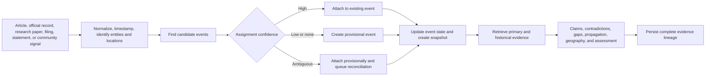
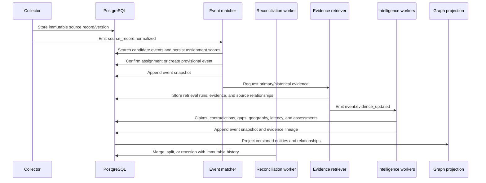

# Event-Centric Intelligence Architecture

Status: Mandatory architecture extension  
Companions: [System architecture](ARCHITECTURE.md), [Critical implementation guardrails](IMPLEMENTATION_GUARDRAILS.md)

## 1. Core operating model

The event—not the article—is the primary unit of user-facing analysis.

An article is one source's observation or interpretation of an event. A primary document is evidence about an event. A community post is an early signal that may or may not become evidence. Claims, contradictions, timelines, geographic scope, source propagation, verification, and assessments attach to the evolving event record.



### 1.1 Event-centric invariants

1. Every processed source observation is attached to exactly one current event or one explicitly provisional event.
2. Event assignment is versioned and reversible. Early assignments are not treated as permanent truth.
3. Merge and split operations preserve aliases, assignment history, snapshots, and provenance.
4. Articles, official records, datasets, filings, and social signals remain distinct source-record types.
5. A social/community signal cannot become verified evidence merely because it is popular.
6. Event summaries, claims, timelines, contradictions, gaps, and assessments reference stored evidence.
7. Every material event update creates an append-only snapshot.
8. Event-level confidence is never a substitute for claim-level verification.
9. Source propagation and source independence operate on evidence lineages, not URL or publisher counts.
10. No event analysis is published when its evidence manifest fails validation.

### 1.2 Assignment lifecycle

Event assignment states:

- `provisional` — created or attached from limited early metadata;
- `candidate` — one of multiple plausible events;
- `confirmed` — assignment exceeds evaluated thresholds;
- `reassigned` — moved to another event with history retained;
- `merged` — event became an alias of another event;
- `split` — observation moved into a newly separated event;
- `human_reviewed` — assignment was explicitly curated.

The fast path assigns using title, lead, entities, locations, source time, and article embeddings. The enriched path re-evaluates after full extraction, claims, and evidence are available. Offline reconciliation corrects over-broad and fragmented events.

## 2. Event record

An event is an evolving real-world occurrence, decision, discovery, announcement, proceeding, release, or development.

The canonical event contains:

- identity, aliases, and lifecycle state;
- canonical and alternative titles;
- event type and taxonomy;
- occurred/start/end time with precision and uncertainty;
- first internal detection time;
- earliest known public evidence time;
- first verified-report time;
- last material update time;
- involved entities and their roles;
- resolved locations and geographic scope;
- source observations and evidence;
- claims and verification revisions;
- contradictions and competing interpretations;
- source propagation graph;
- historical timeline and related events;
- contextual gaps and open questions;
- event snapshots and change explanations;
- evidence-backed summary and Analyst Assessment;
- emerging-story and importance scores;
- complete evidence lineage.

### 2.1 Event time semantics

The system stores distinct clocks:

| Timestamp | Meaning |
|---|---|
| `occurred_at` | When the real-world occurrence happened, if known |
| `occurred_at_precision` | Exact time, day, month, range, or unknown |
| `source_published_at` | Time claimed by the source |
| `source_modified_at` | Time claimed for a source update |
| `first_observed_at` | First time the platform saw this source record |
| `retrieved_at` | Time the platform fetched the exact version |
| `event_first_detected_at` | First time the platform created/detected the event |
| `earliest_public_evidence_at` | Earliest timestamp among validated public evidence |
| `first_verified_report_at` | Earliest independently validated reporting record |
| `event_last_material_change_at` | Last change that altered event understanding |

Unknown or imprecise timestamps remain unknown or imprecise. The platform never substitutes publication time for occurrence time without labeling the inference.

## 3. Primary-source ingestion

Primary records are first-class source records, not attachments hidden behind news articles.

### 3.1 Source classes

| Class | Examples | Typical adapters |
|---|---|---|
| Government | Ministries, agencies, official gazettes, statistics offices | RSS, API, HTML, PDF, bulk data |
| Regulatory | Securities, competition, telecom, environment, health regulators | Filing APIs, RSS, bulk feeds |
| Judicial | Court opinions, dockets, orders, judgments | APIs, court feeds, approved repositories |
| Legislative | Bills, debates, votes, parliamentary proceedings | APIs, XML, transcripts, bulk datasets |
| Scientific | Papers, preprints, datasets, trial registries | APIs, OAI-PMH, Crossref-like metadata, repositories |
| Corporate | Press releases, investor relations, earnings, exchange filings | RSS, filing APIs, HTML, PDF |
| Institutional | Standards bodies, universities, NGOs, intergovernmental organizations | RSS, API, HTML, repositories |
| Direct statement | Speeches, transcripts, verified official statements | API, transcript, approved social endpoint |
| Reporting | Original reporting, wire services, specialist press | RSS, API, licensed feeds, permitted pages |
| Community signal | Forums, developer platforms, research discussions, public boards | Official APIs and permitted feeds |

### 3.2 Evidence priority and trace-back

For each material news claim, the retrieval pipeline attempts to identify the underlying record:

```text
news claim
→ cited link or quoted document
→ original statement, filing, paper, dataset, order, transcript, or release
→ exact passage/field/table
```

If the original record cannot be found, that absence is stored. A news report that cites an inaccessible document may still be evidence, but it is not mislabeled as the primary record.

Every source record stores:

- source class and subtype;
- issuing person/organization;
- stable identifier and canonical URL;
- publication, effective, and retrieval times;
- version, amendment, correction, or withdrawal status;
- content hash and permitted artifact;
- exact text/table/page offsets;
- rights and display policy;
- authenticity/identity checks;
- event and claim mappings.

## 4. Event-first processing flow



No long-running stage occurs inside an API request. Each worker is idempotent, version-aware, horizontally scalable, and observable.

## 5. Event assignment and reconciliation

### 5.1 Candidate retrieval

Candidate events are retrieved using:

- dense similarity over event centroids and representative claims;
- sparse title/entity/location matching;
- shared canonical entities and relationships;
- temporal compatibility;
- geographic compatibility;
- event type;
- named document, product, policy, case, bill, paper, vulnerability, mission, or transaction identifiers.

### 5.2 Deterministic assignment features

Persisted assignment features include:

```text
semantic_similarity
title_similarity
entity_overlap
identifier_overlap
claim_overlap
temporal_compatibility
geographic_compatibility
event_type_compatibility
source_lineage_overlap
novelty_score
```

A calibrated classifier or deterministic policy may select the assignment, but all candidate scores and versions are stored. An LLM may extract structured attributes; it cannot silently choose an event without an auditable assignment record.

### 5.3 Merge and split safety

- Merges create an event alias and preserve both histories.
- Splits create child events and record why each source observation moved.
- User-facing URLs remain resolvable after merges.
- Claim, verification, timeline, and assessment artifacts are recalculated when their evidence membership changes.
- Human-curated changes are audited and can be reversed.

## 6. News latency and information propagation

### 6.1 Latency metrics

For each source observation:

```text
collection_latency = first_observed_at - source_published_at
retrieval_latency = retrieved_at - first_observed_at
source_lead_lag = source_published_at - earliest_public_evidence_at
event_detection_latency = event_first_detected_at - earliest_public_evidence_at
verification_latency = first_verification_at - event_first_detected_at
```

`source_lead_lag` is reported only when the baseline timestamp is sufficiently reliable. Negative values may indicate an earlier source, a timestamp error, embargo leakage, timezone error, or backdated content and must be investigated rather than automatically celebrated.

### 6.2 Propagation graph

Nodes:

- source records;
- publishers and issuing organizations;
- evidence lineages;
- events.

Edges:

- `originally_reported_by`;
- `republished_from`;
- `cites`;
- `quotes`;
- `links_to`;
- `derived_from`;
- `responds_to`;
- `corrects`;
- `amplifies`;
- `independently_confirms`;
- `likely_influenced_by`.

Each inferred edge has method, confidence, temporal plausibility, supporting features, and review state.

Propagation analytics include:

- first observed source;
- first primary record;
- first independent confirmation;
- time to mainstream coverage;
- time to cross-country/cross-language coverage;
- source responsiveness by domain;
- propagation depth and breadth;
- original-to-derivative ratio;
- correction propagation lag.

These metrics describe observed coverage, not absolute journalistic quality.

## 7. Historical snapshots and narrative evolution

### 7.1 Append-only versioning

The platform stores:

- every fetched article/document version;
- event snapshots after material changes;
- claim and verification revisions;
- event membership revisions;
- timeline revisions;
- contradiction and gap revisions;
- summary and assessment revisions;
- source reliability profile snapshots.

An event snapshot references the exact source-record versions and calculation versions used to construct it.

### 7.2 Material change detection

Material changes include:

- new or changed factual claim;
- correction, retraction, or withdrawal;
- changed number, date, location, identity, or status;
- primary evidence added;
- contradiction resolved or introduced;
- uncertainty narrowed or widened;
- event merge/split/reassignment;
- source lineage corrected;
- verification label/confidence changed;
- assessment implications changed.

Cosmetic edits remain stored at the article-version level but need not create a prominent narrative change.

### 7.3 User-facing evolution view

Users can compare any two event snapshots and see:

- facts added, removed, or corrected;
- claims whose labels changed;
- evidence introduced or withdrawn;
- conflicting positions and their resolution;
- source/lineage changes;
- uncertainty changes;
- summary and assessment diffs;
- who/what process created the revision.

## 8. Source relationship and attribution network

The network distinguishes a publisher, an issuing organization, an author, a wire service, a document, and an evidence lineage.

### 8.1 Attribution-chain detection

Signals include:

- canonical URLs and explicit credits;
- bylines and datelines;
- “according to” and “reported by” attribution;
- paragraph and quotation overlap;
- document fingerprints and MinHash/SimHash;
- publication ordering and update times;
- embedded links;
- known syndication/licensing relationships;
- press-release and filing text reuse;
- shared anonymous-source descriptions;
- author and newsroom relationships.

The result is a directed attribution graph, not merely a duplicate group.

### 8.2 Original reporting classification

Possible roles:

- `primary_record`;
- `original_reporting`;
- `independent_confirmation`;
- `analysis`;
- `derivative_reporting`;
- `syndicated_republication`;
- `aggregation`;
- `commentary`;
- `community_signal`;
- `unknown`.

These roles are evidence-backed and revisable. “First published” is not automatically “original reporting.”

## 9. Social and community intelligence

Community sources may include official, permitted feeds from:

- technical forums;
- research discussion communities;
- developer platforms;
- security advisory communities;
- public discussion boards;
- issue trackers and release feeds;
- approved public social endpoints.

### 9.1 Signal isolation

Community records are labeled `signal`, not `verified_reporting`. They may:

- create a provisional event;
- raise an emerging-story score;
- trigger evidence retrieval;
- reveal expert discussion or technical artifacts;
- provide leads for human review.

They may not:

- independently verify a factual claim without admissible evidence;
- increase source-reliability history as if they were reporting;
- be silently quoted as fact;
- expose deleted/private content beyond policy.

The UI visually distinguishes community attention, primary evidence, original reporting, and derivative coverage.

### 9.2 Manipulation controls

- detect coordinated posting, bot-like activity, repost storms, and single-community concentration;
- cap contribution per account, thread, domain, and lineage;
- require cross-domain movement for strong emergence;
- retain platform/API and deletion-policy metadata;
- label unverifiable identity and self-reported expertise;
- exclude private or access-controlled communities without authorization.

## 10. Emerging story detection

Emergence is computed at the event level and must not be a raw popularity count.

### 10.1 Signals

- growth rate in unique source observations;
- publication velocity and acceleration;
- growth in independent evidence lineages;
- source-domain diversity;
- community discussion intensity and acceleration;
- cross-domain movement from specialist/community to mainstream;
- primary-record appearance;
- entity novelty and new relationship formation;
- geographic spread;
- search/follow interest;
- historical baseline and seasonality;
- manipulation and duplication penalties.

### 10.2 Scoring

Persist each component:

```text
emergence_score =
    0.20 * volume_growth
  + 0.15 * publication_acceleration
  + 0.15 * independent_lineage_growth
  + 0.10 * source_domain_diversity
  + 0.10 * community_acceleration
  + 0.10 * cross_domain_attention
  + 0.10 * novelty
  + 0.05 * geographic_spread
  + 0.05 * primary_evidence_signal
  - manipulation_penalty
  - duplication_penalty
```

Weights are versioned and evaluated by domain. The score creates an alert, not a truth judgment.

Lifecycle:

```text
weak_signal → emerging → accelerating → mainstream → cooling → dormant
```

## 11. Geographic intelligence

### 11.1 Location resolution

Extracted location mentions are resolved to canonical places using:

- name and alias;
- language/transliteration;
- containing region and country;
- nearby entities;
- event type;
- coordinates supplied by primary records;
- source location and dateline, without assuming either is the event location.

Store candidate places and disambiguation scores. “Washington” is not resolved without context.

### 11.2 Spatial model

Use PostGIS as the canonical spatial layer:

- canonical points, polygons, and administrative boundaries;
- `geometry` for regional shapes;
- `geography` for earth-distance queries;
- GiST spatial indexes;
- event-location roles and confidence.

Location roles:

- `occurred_at`;
- `affects`;
- `announced_from`;
- `organization_based_in`;
- `reported_from`;
- `originated_from`;
- `route_or_area`;
- `unknown_relation`.

An event may have multiple locations and a geographic scope from local to global.

### 11.3 Geographic products

- map and timeline exploration;
- regional event feeds;
- event density and trend maps;
- cross-border propagation;
- regional source-coverage gaps;
- spatial clustering by event type;
- affected-area and jurisdiction filters.

## 12. Dynamic source reliability profiles

Reliability is a versioned multidimensional profile, not a permanent universal score.

### 12.1 Dimensions

- correction and retraction behavior;
- factual verification outcomes after sufficient evidence;
- original-source transparency;
- evidence citation quality;
- named versus opaque sourcing;
- domain expertise;
- reporting timeliness;
- independence/originality;
- update transparency;
- historical consistency;
- ownership and conflict disclosures;
- extraction/authenticity confidence.

Profiles are segmented by:

- topic/domain;
- geography/language;
- source type;
- time window.

A technology outlet's software expertise does not establish its reliability in public health or geopolitics.

### 12.2 Update safeguards

- Use only adjudicated or sufficiently mature events.
- Weight by evidence quality and verification certainty.
- Apply Bayesian/shrinkage priors so small samples do not produce extreme scores.
- Decay old observations.
- Store sample size, uncertainty interval, and profile version.
- Separate correction willingness from original error frequency.
- Prevent the source score from becoming self-confirming: source reliability may influence confidence, but verification outcomes used to update reliability must be recomputed with controlled ablation or human-reviewed ground truth.
- Provide appeal/correction and manual-review workflows.

The UI shows dimensions and uncertainty, not a simplistic “trusted/untrusted” badge.

## 13. Contradiction discovery and conflict analysis

### 13.1 Conflict units

Contradictions are evaluated between atomic propositions, structured values, datasets, or interpretations:

- factual contradiction;
- numerical discrepancy;
- temporal disagreement;
- identity/location disagreement;
- causal disagreement;
- methodological disagreement;
- scope/definition mismatch;
- prediction disagreement;
- normative or interpretive difference.

Not every difference is a contradiction. Two sources may describe different time windows or definitions.

### 13.2 Pipeline

1. Extract atomic claims with source offsets.
2. Normalize entities, units, time windows, and definitions.
3. Retrieve candidate conflicting claims within an event or related events.
4. Classify relation: entailment, contradiction, partial conflict, different scope, or unrelated.
5. Validate exact passages and structured values.
6. Group conflicts by issue.
7. Present positions side by side with evidence and source independence.

Each conflict record stores both positions, evidence, relation type, model/rule scores, scope differences, unresolved questions, and resolution status.

Analyst Assessment may explain a conflict but cannot resolve it without evidence.

## 14. Contextual gap detection

Gap detection asks what an evidence-backed understanding would normally require and what is absent.

Gap categories:

- missing primary record;
- missing response from a materially affected party;
- missing historical comparison;
- missing denominator or baseline;
- missing methodology or dataset;
- missing geographic/population scope;
- omitted counterevidence;
- missing independent confirmation;
- unanswered causal question;
- undisclosed conflict or ownership;
- unresolved date, identity, number, or definition;
- missing follow-up outcome.

### 14.1 Detection method

- event-type-specific completeness templates;
- expected entity/role matrix;
- claim-to-evidence coverage;
- historical analog retrieval;
- contradiction and open-question records;
- source diversity and affected-party coverage;
- deterministic checks for absent fields/records;
- model suggestions validated against retrieved context.

A gap is displayed as a question or missing-evidence statement, not as proof of bias or wrongdoing.

## 15. News knowledge graph

### 15.1 Node types

- Event
- SourceRecord
- ArticleVersion
- EvidenceItem
- Claim
- VerificationRevision
- Person
- Organization
- GovernmentBody
- Publisher
- Location
- Product
- Technology
- Policy
- Law
- CourtCase
- ScientificConcept
- Paper
- Dataset
- Filing
- Statement
- CommunityThread
- Topic

### 15.2 Relationship types

- `OBSERVES`
- `SUPPORTS`
- `CONTRADICTS`
- `CONTEXTUALIZES`
- `DERIVED_FROM`
- `CITES`
- `QUOTES`
- `REPUBLISHED_FROM`
- `AUTHORED_BY`
- `ISSUED_BY`
- `INVOLVES`
- `OCCURRED_AT`
- `AFFECTS`
- `REGULATES`
- `OWNS`
- `EMPLOYS`
- `ANNOUNCED`
- `FILED`
- `DECIDED`
- `PART_OF`
- `FOLLOW_UP_TO`
- `CAUSED_BY`
- `RESPONDS_TO`
- `CORRECTS`
- `SUPERSEDES`
- `SAME_AS`

Every edge has:

- source evidence IDs;
- source offsets;
- valid time and observed time;
- extraction method/version;
- confidence;
- review state;
- provenance activity ID.

### 15.3 Storage strategy

- PostgreSQL remains canonical for nodes, typed edges, temporal versions, and constraints.
- PostGIS stores spatial entities and event geographies.
- Qdrant provides semantic candidate retrieval.
- A graph engine such as Neo4j may be introduced as a rebuildable projection for deep multi-hop exploration when measured query needs justify it.
- Graph projections never become the sole provenance store.

This avoids adding an operationally expensive database before graph-query workloads are proven while preserving a clean projection path.

## 16. Evidence-lineage framework

The provenance model follows the W3C PROV concepts of entities, activities, agents, derivation, attribution, versioning, and reproducibility.

### 16.1 Provenance primitives

- **Entity** — source record version, evidence passage, claim, event snapshot, calculation, or generated artifact.
- **Activity** — fetch, extract, normalize, match, retrieve, classify, verify, summarize, reconcile, or review.
- **Agent** — publisher, issuing organization, user, worker service, model/provider, or reviewer.

Core lineage edges:

- `wasDerivedFrom`;
- `wasGeneratedBy`;
- `used`;
- `wasAttributedTo`;
- `wasAssociatedWith`;
- `wasRevisionOf`;
- `wasInvalidatedBy`.

### 16.2 Required lineage chain

Every displayed item resolves through:

```text
displayed statement
→ generated artifact field or deterministic result
→ processing activity and version
→ claim/calculation/timeline/conflict/gap record
→ exact evidence passage or structured field
→ immutable source-record version
→ canonical URL or stable primary-record identifier
```

For a confidence score:

```text
displayed confidence
→ calibrated score record
→ calibrator and feature vector
→ evidence weights and lineage collapse
→ exact evidence items
→ source-record versions
```

For an Analyst Assessment sentence:

```text
assessment sentence
→ cited verified claims/timeline/conflicts/gaps
→ immutable verification revisions
→ evidence manifests
→ source-record versions
```

### 16.3 Lineage validation

Publication fails if:

- a factual statement has no evidence edge;
- a timeline event lacks a source record and date;
- a claim label lacks a verification calculation;
- a confidence score lacks features/calibrator version;
- an assessment conclusion lacks cited factual premises;
- a graph edge lacks evidence or is not explicitly marked inferred;
- a source URL/identifier cannot be resolved under its retention policy.

## 17. Schema extensions

### Event core

- `events`
- `event_aliases`
- `event_assignments`
- `event_assignment_candidates`
- `event_reconciliation_actions`
- `event_snapshots`
- `event_snapshot_diffs`
- `event_status_history`
- `event_time_assertions`

### Source records and versions

- `source_records`
- `source_record_versions`
- `source_record_identifiers`
- `source_record_event_links`
- `primary_source_metadata`
- `community_signals`

Articles become a specialized source-record projection for convenient product queries; they no longer define the analytical center.

### Latency and propagation

- `source_observation_times`
- `event_latency_metrics`
- `source_relationships`
- `propagation_edges`
- `propagation_snapshots`

### Geography

- `places`
- `place_aliases`
- `event_places`
- `source_record_places`
- `geographic_scopes`

### Reliability

- `source_reliability_profiles`
- `source_reliability_dimensions`
- `source_reliability_observations`
- `source_reliability_snapshots`

### Conflicts and gaps

- `conflict_sets`
- `conflict_positions`
- `conflict_evidence`
- `contextual_gaps`
- `gap_evidence`
- `open_questions`

### Knowledge graph and provenance

- `knowledge_nodes`
- `knowledge_edges`
- `provenance_entities`
- `provenance_activities`
- `provenance_agents`
- `provenance_relations`
- `lineage_validation_runs`

All revisioned tables are append-only. Current-state views are database views/materialized projections over immutable revisions.

## 18. API extensions

| Method and path | Purpose |
|---|---|
| `GET /events/{id}` | Canonical event intelligence record |
| `GET /events/{id}/sources` | Reporting, primary records, and community signals by role |
| `GET /events/{id}/evidence` | Evidence manifests and source-record versions |
| `GET /events/{id}/timeline` | Evidence-backed historical and update timeline |
| `GET /events/{id}/snapshots` | Narrative and verification evolution |
| `GET /events/{id}/diff?from=&to=` | Changes between event snapshots |
| `GET /events/{id}/propagation` | Attribution and media-spread graph |
| `GET /events/{id}/latency` | Detection and source reporting latency |
| `GET /events/{id}/contradictions` | Competing claims and evidence |
| `GET /events/{id}/gaps` | Missing context and open questions |
| `GET /events/{id}/geography` | Resolved places and spatial scope |
| `GET /events/{id}/lineage` | Complete machine-readable provenance bundle |
| `GET /emerging-events` | Ranked emerging events with component scores |
| `GET /sources/{id}/reliability` | Versioned multidimensional reliability profile |
| `GET /graph/neighborhood` | Evidence-constrained graph exploration |
| `POST /admin/events/{id}/reconcile` | Merge, split, or reassign with reason |
| `POST /admin/lineage/{id}/review` | Correct attribution/evidence lineage |

Article routes remain available, but their primary navigation target is the event record.

## 19. Event-focused interface

The event page is the main analytical workspace:

1. current event state and “what changed”;
2. verified claims and confidence;
3. primary evidence;
4. reporting and source roles;
5. historical/update timeline;
6. contradictions and competing positions;
7. contextual gaps and open questions;
8. source propagation and latency;
9. geography and affected regions;
10. Analyst Assessment;
11. snapshot history;
12. evidence lineage/provenance inspector.

Community signals appear in a separate panel with an explicit unverified-status label.

## 20. Event-driven contracts

Additional events:

```text
source_record.normalized
event.provisional_created
event.assignment_proposed
event.assignment_confirmed
event.assignment_changed
event.merge_completed
event.split_completed
event.evidence_updated
event.snapshot_created
event.material_change_detected
event.propagation_updated
event.geography_updated
event.contradiction_detected
event.gap_detected
event.emergence_changed
source.lineage_updated
source.reliability_updated
knowledge_graph.projection_requested
lineage.validation_failed
```

## 21. Evaluation and release gates

Mandatory labeled evaluations:

- same-event/different-event assignment;
- provisional-event fragmentation and over-merge rate;
- merge/split correctness;
- primary-source trace-back;
- source-role and attribution-chain classification;
- latency timestamp accuracy;
- propagation edge precision;
- source-lineage independence;
- snapshot and narrative-diff correctness;
- social-signal manipulation resistance;
- early-event precision and lead time;
- geocoding and event-location role accuracy;
- reliability-profile calibration and domain separation;
- contradiction relation precision/recall;
- contextual-gap usefulness and false-accusation rate;
- knowledge-graph entity resolution and edge precision;
- evidence-lineage completeness.

Release-blocking invariants:

- 100% of published event statements have valid lineage paths.
- 100% of timeline entries map to stored source-record versions.
- 100% of displayed confidence values map to stored calculations and evidence.
- Social/community signals never count as verified confirmation without qualifying evidence.
- Syndicated/derivative records contribute one underlying lineage.
- Event merge/split/reassignment never deletes history.
- Event snapshots reproduce from their versioned inputs.
- Missing lineage prevents publication.

## 22. Technology decisions

| Concern | Decision |
|---|---|
| Canonical event/source/lineage data | PostgreSQL |
| Spatial storage and queries | PostGIS |
| Semantic candidate retrieval | Qdrant |
| Deep graph exploration | PostgreSQL first; optional rebuildable Neo4j projection |
| Immutable artifacts | S3-compatible object storage |
| Processing | Kafka-compatible queues and independently scalable workers |
| Provenance semantics | W3C PROV-inspired entity/activity/agent model |

## 23. References

- [W3C PROV overview](https://www.w3.org/TR/prov-overview/)
- [PostGIS documentation](https://postgis.net/docs/)
- [GitHub Events REST API](https://docs.github.com/en/rest/activity/events)
- [Neo4j operations documentation](https://neo4j.com/docs/operations-manual/current/)
