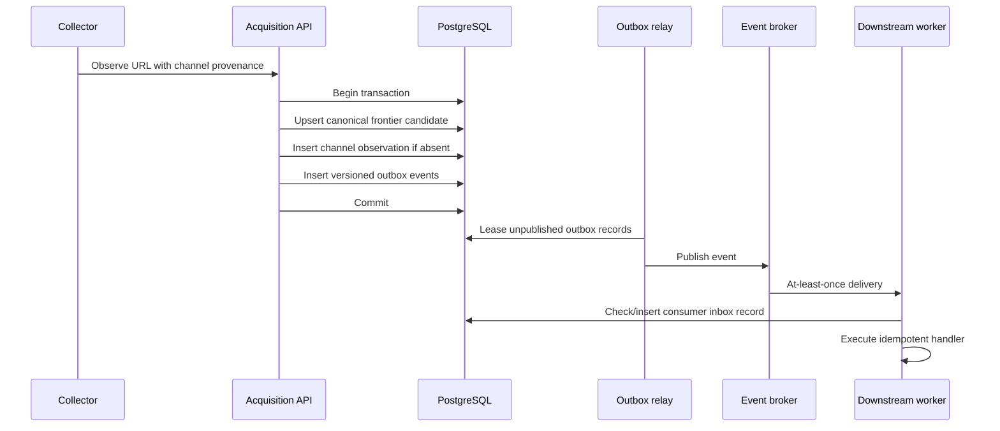

# Module Synchronization Contract

The platform synchronizes modules through versioned integration events, not direct cross-module database writes.

## Transaction boundary

The acquisition service performs one PostgreSQL transaction containing:

1. canonical publisher/channel/frontier state;
2. channel-level discovery provenance;
3. priority calculation and policy version;
4. one or more outbox events.

If any write fails, none of them commit.



## Event envelope

Every event contains:

- event UUIDv7;
- event type and schema version;
- aggregate type and ID;
- JSON payload;
- occurrence timestamp;
- producer;
- correlation and causation IDs;
- W3C `traceparent` when available;
- deterministic idempotency key.

## Initial acquisition events

- `publisher.created`
- `discovery.channel_created`
- `discovery.item_observed`
- `frontier.url_admitted`
- `source.poll.completed`
- `source.poll.failed`

`discovery.item_observed` is emitted once per canonical URL candidate and discovery channel. A second channel finding the same URL produces another observation event but not another frontier candidate.

## Delivery guarantees

- Database/outbox write: atomic.
- Broker delivery: at least once.
- Consumer handling: idempotent through `(consumer_name, event_id)`.
- Ordering: guaranteed only within the chosen aggregate/partition key.
- Retry: exponential backoff with bounded attempts.
- Permanent failure: dead letter with replay metadata.
- Schema evolution: additive changes within a version; breaking changes require a new event version.

## Module ownership

| Module | Owns |
|---|---|
| Acquisition | Publishers, channels, URL observations, frontier admission |
| Fetching | HTTP response versions, redirect chains, fetch status |
| Extraction | Structured metadata and clean content versions |
| Identity | Canonical article identity, variants, duplicate and lineage relationships |
| Events | Event assignment, reconciliation, snapshots |
| Evidence | Retrieval runs, evidence mappings, claims |
| Verification | Deterministic labels and confidence calculations |
| Intelligence | Summaries, contradictions, gaps, assessments, reports |

A module may read another module's public projection or consume its integration events. It may not mutate another module's owned tables.

## Poll-worker synchronization

Multiple poll workers coordinate through expiring database leases:

1. claim due channels with `FOR UPDATE SKIP LOCKED`;
2. commit the lease before network work;
3. create an immutable poll-run record;
4. fetch and parse outside the database transaction;
5. admit each discovery through the acquisition service;
6. atomically complete the poll run, update channel schedule/health, release the lease, and write a completion or failure outbox event.

If a worker crashes, its lease expires and another worker may reclaim the channel. Reprocessing is safe because URL identity, channel observations, and outbox idempotency keys are unique.

## Current API workflow

All protected endpoints require a server-validated authenticated identity. Browser
sessions use an HttpOnly application session cookie; API clients use an
OIDC-compatible bearer token:

```text
Authorization: Bearer <signed-provider-jwt>
```

The backend loads the matching `platform_users` row and enforces approval status
and role permissions on every protected request. Local development can explicitly
enable `NEWSINTEL_DEV_AUTH_BYPASS_ENABLED=true`; production rejects that setting.

1. `POST /api/v1/admin/publishers`
2. `POST /api/v1/admin/discovery-channels`
3. `POST /api/v1/admin/discovery-channels/{channel_id}/poll`
4. `POST /api/v1/internal/discoveries`

The discovery response identifies whether the canonical candidate and channel observation were newly created and returns the outbox event IDs produced by the transaction.
